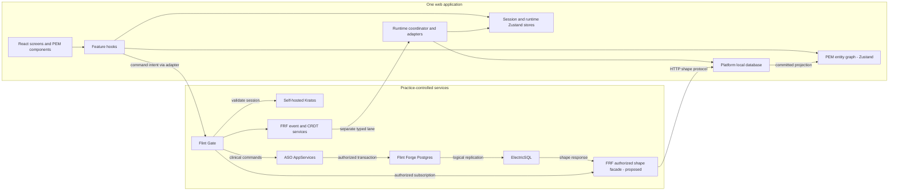
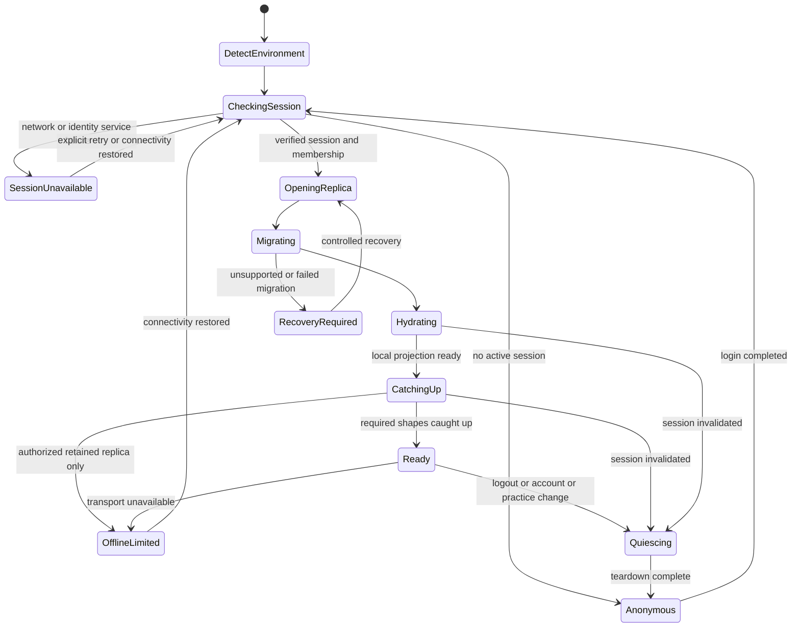
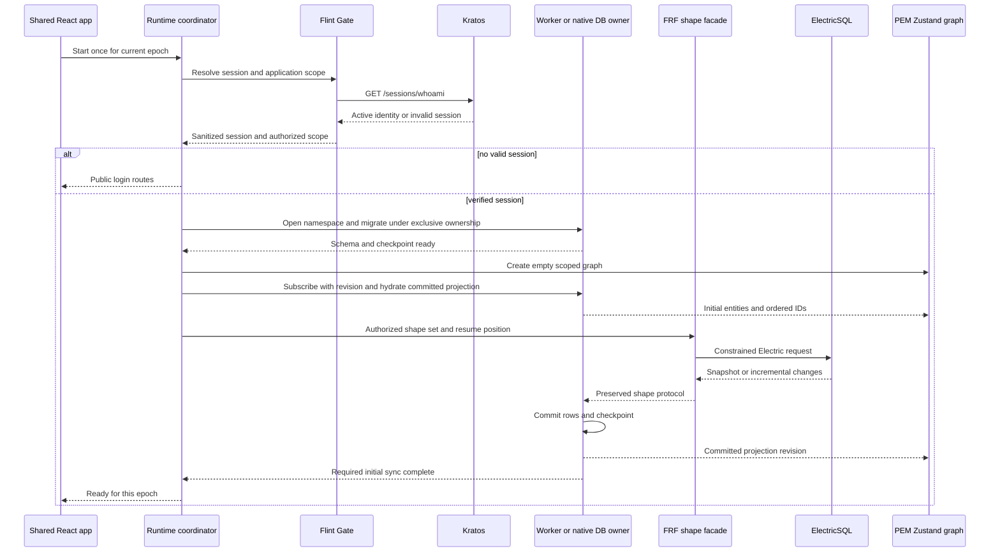
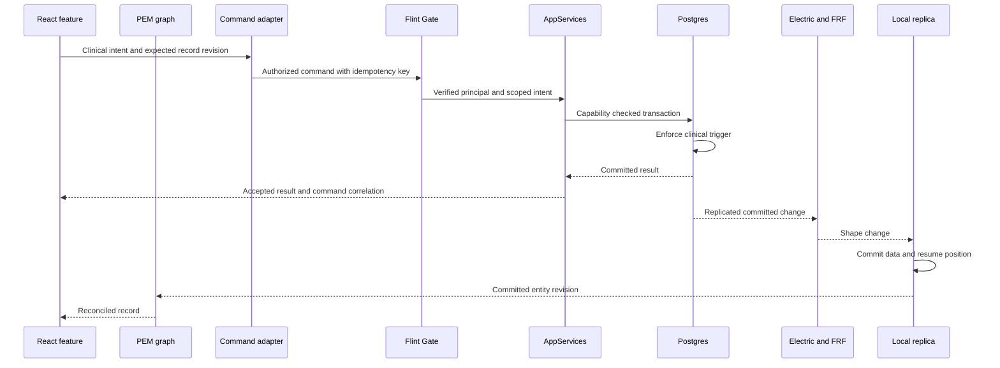
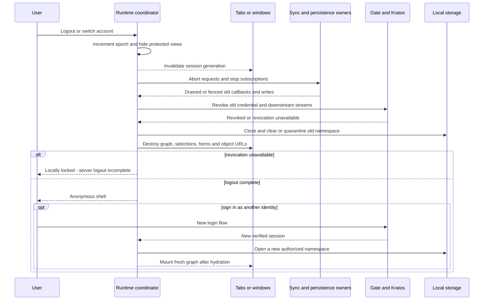
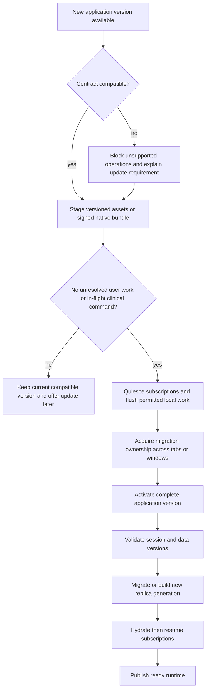

# Application runtime architecture: browser and Tauri

**Status:** Accepted target architecture; implementation is not certified.
**ADR reconciliation:** 2026-09-06; see the [complete ADR index](README.md).  
**Date:** 2026-09-06.  
**Scope:** Prior Authorization Workbench, Flint Forge, Flint Gate, Flint Realtime Fabric, Prometheus entity management, and self-hosted Ory Kratos.  
**Phase:** Spec/Plan within `web-ui-architecture`. No application implementation accompanies this document.

## 1. Decision and the difficult tradeoff

Use one React application in `web/`, one normalized Prometheus entity graph, and one explicit session/runtime lifecycle. Select platform adapters at application startup. Browser storage uses PGlite in a worker. The preferred production desktop target uses host-owned SQLite with typed Tauri commands. Keep PGlite-in-Tauri as the initial parity baseline until native replication and query adapters pass the same contracts.

Realtime relational data follows **Postgres → ElectricSQL → Flint Realtime Fabric's proposed authorized shape facade → local database → Prometheus entity graph → React**. The graph is already a Zustand vanilla store. Additional Zustand stores expose session, startup, update, and per-view interaction state; they do not duplicate clinical records.

**The uncomfortable thing:** choosing native SQLite improves desktop ownership and persistence integration, but adds a second SQL dialect and a replication adapter that does not yet exist as a complete solution in these repositories. A shared Zustand API cannot conceal missing transaction, hydration, migration, or authorization semantics. If native parity is not demonstrated, ship the worker PGlite path first rather than claiming SQLite is a drop-in replacement.

This design preserves clinical authority in gateway policy, `AppServices`, and Postgres triggers. Neither a local SQL write nor a Zustand action can affirm a gate or sign a letter.

## 2. Workspace and evidence baseline

Open [prior-auth.code-workspace](../../prior-auth.code-workspace) to work across all five folders. The four companion folders are references to existing repositories, not copied source, Git submodules, or package-manager dependencies. The file does not alter Codex sidebar/project settings. Relative paths assume the current sibling layout beneath `Projects/`.

| Repository | Responsibility in this design | Observed source and limitation |
|---|---|---|
| `prior-auth` | Shared UI, application startup, domain services, clinical policy integration, deployment composition | `web/src/main.tsx` supplies a development-only stand-in session and a null production session pending Kratos integration; `graph-provider.tsx` opens in-memory PGlite and does not await or retain the local-first runtime. `desktop/src-tauri` contains pure service wrappers, without the Tauri runtime dependency. |
| `flint-forge` | Practice Postgres substrate; database access, RLS and Cedar capabilities where Forge services are used | `crates/fdb-gateway/src/bootstrap.rs`, `authz_mode.rs`, and `crates/fdb-postgres`. ASO currently composes Forge's Postgres image; this does not prove every Forge API is on the ASO request path. |
| `flint-gate` | Public entry point, Kratos session validation, policy, downstream identity projection | `crates/flint-gate-core/src/auth/kratos.rs` forwards cookies and Authorization to Kratos; `auth/jwt_mint.rs` supplies JWT minting. Route-specific integration and revocation behavior still need proof. |
| `flint-realtime-fabric` | Authorized realtime facade; relational shape routing plus separate event/CRDT lanes | Its router and TS `RealtimeAdapter` expose event services; the inspected code contains no Electric shape proxy or PGlite table materializer. `main.rs` composes an in-memory entity read store. An Electric facade is proposed work. |
| `prometheus-entity-management` | Framework-neutral entity graph, React hooks/components, persistence and realtime adapters | Core `graph.ts` uses `zustand/vanilla`. PGlite and Tauri SQL adapters store serialized graph snapshots. They are not database replication engines. |
| Self-hosted Kratos | Identity, authentication flows, session lifecycle | Compose names a Kratos image; no live deployment/version capability test was performed. Ory Network-only features are not assumed available. |

Source reading takes precedence over comments that claim a completed integration. In particular, PEM's `adapters/electricsql.ts` forwards shape changes to graph subscribers and listens for SQL notifications; its inspected implementation does **not** insert the shape rows into PGlite. Its header diagram alone is insufficient evidence of database hydration.

The installed app declares React 19.2.0, Zustand 5.0.8, PGlite `^0.5.8`, Electric client `^1.5.27`, and entity-graph React `^4.0.0`. These are observations from `web/package.json`, not newly selected pins. `versions.toml` remains unchanged. A future implementation must verify and pin the selected compatible set, including any new sync or Tauri packages.

## 3. Deployment topology and trust boundaries

The facade is an HTTP proxy for Electric's protocol, not a conversion of shapes into arbitrary Iggy events. Electric retains responsibility for shape snapshots, handles, offsets and refetch semantics. FRF owns the authorized exposure and lifetime of those subscriptions. Its existing broker/CRDT services remain separate lanes. This implements the requested routing through the fabric without creating two competing streams for the same clinical row.

The gateway and facade derive practice membership, permitted entities, columns and predicates from verified server context. Client `where`, table names, or a Zustand practice ID are never sufficient authorization. Strip or reject client attempts to broaden shapes. Preserve Electric protocol headers, streaming behavior, continuation parameters and errors through the proxy. Authorize continuation requests too; do not expose the upstream Electric port to clients. This follows Electric's documented proxy-auth pattern. [Electric authentication](https://electric.ax/docs/sync/guides/auth)

Use the current base-table projections and server-maintained `practice_id` columns. Do not reintroduce SQL views as replication sources: this project's live investigation found both ordinary and materialized views unsuitable for its Electric path. Client schema omission is useful but cannot prevent sensitive fields from arriving on the wire. Server column/row authorization is mandatory.

## 4. One application, explicit environment adapters

The composition root selects a browser or desktop adapter once. Tauri provides `isTauri()` in `@tauri-apps/api/core`; follow detection with a typed host capability/version handshake. The detected environment is a routing fact, not an authorization claim. Avoid user-agent checks and scattered conditionals in feature components. [Tauri core API](https://v2.tauri.app/reference/javascript/api/namespacecore/)

| Concern | Browser | Tauri desktop |
|---|---|---|
| Authentication credential | Secure HttpOnly Kratos cookie via same-origin proxy | Native host owns opaque session token; webview receives a sanitized session projection |
| Local database | PGliteWorker; IndexedDB initially, OPFS after measurement | Preferred: SQLite owned by trusted Rust host; PGlite worker parity baseline |
| Relational replication | Electric protocol via Gate/FRF into worker tables | Same protocol via Gate/FRF into host SQLite, using a new transactional materializer |
| Clinical commands | Feature API → Gate → ASO services | Typed IPC → trusted host request → Gate → authoritative ASO service; preserve the same domain command contract |
| Presentation | Same routes, hooks, PEM components and graph selectors | Same, with desktop chrome and native capabilities injected |
| Code updates | Versioned web assets and coordinated reload | Signed native package containing matching frontend/host versions |

Proposed application-owned contracts: `RuntimeEnvironment`, `SessionAdapter`, `LocalReplica`, `RealtimeAdapter`, `CommandTransport`, and `UpdateCoordinator`. These names describe design interfaces, not existing exported APIs. Their contract covers open/migrate/hydrate/subscribe/stop/close, readiness, cancellation and session ownership; it must not expose arbitrary SQL to feature components.

Refactor the existing PGlite-specific timeline API behind typed repository operations during implementation. Browser and desktop repositories return identical domain records and ordered IDs, even if their SQL differs. Shared code must not import Tauri plugins with startup side effects; desktop modules are loaded only by the desktop adapter. An unavailable desktop bridge is an explicit startup failure, not permission to silently switch storage or inference lanes.

`aso-host` remains shell-independent. Tauri integration belongs in the desktop shell, while authorization and domain operations stay in shared services. The native client must not contact a privileged database directly or supply an arbitrary `actor` as authority.

## 5. State ownership and the Zustand boundary

| State | Owner | Lifetime and write authority |
|---|---|---|
| Cases, evidence, citations, letters | Server records; local DB replica; one PEM graph per mounted session | Authorized server commits; local graph is their normalized projection |
| Ordered query results | PEM graph lists | IDs only; rejoin records at render |
| Session summary | Application session Zustand store | Verified identity, practice, session ID, assurance level and capabilities; never raw credentials |
| Startup and replication progress | Application runtime Zustand store | Coordinator writes; separate `databaseReady`, `localHydrated`, `initialSyncComplete`, connectivity and errors |
| Update state | Application update Zustand store | Compatible version, waiting update, safe-to-reload state |
| Selection, expansion, filter input | Per-view interaction Zustand store | Reset on case/session change; windows may disagree intentionally |
| Durable preferences | Preference entities in PEM | Scoped to user/practice/device as appropriate |
| Unsent clinical draft content | Local-only draft entities projected into PEM from a separate draft store | Bound to identity/practice; excluded from rebuildable replica tables and automatic command replay |
| Credentials and encryption keys | Browser cookie mechanism or trusted native host | Excluded from graph snapshots, plugin stores, logs and devtools |

The requested Zustand routing is primarily **routing into PEM's existing Zustand graph**. Do not add parallel `casesStore`, `documentsStore`, or `permissionsStore` copies. Use PEM hooks and components for entity reads and lists in both deployments.

[ADR-008](adr-008-shared-runtime-state-and-sessions.md) supersedes ADR-006 and records the non-durable session/runtime/update projections alongside the Zustand-backed PEM graph. Durable business data remains in the graph. [ADR-009](adr-009-authorized-replicas-and-updates.md) supersedes ADR-007 with FRF-mediated Electric access and the desktop storage branch. The original records remain explicitly historical.

The Tauri Zustand plugin is optional for non-sensitive shell coordination only. Its automatic graceful-exit persistence makes it unsuitable as the default wrapper for session, clinical, or per-view stores. The PEM Tauri plugin already offers graph IPC surfaces; do not enable both plugins as independent graph replication owners. [Zustand plugin persistence](https://tb.dev.br/tauri-store/plugin-zustand/guide/persisting-state)

## 6. PGlite methodology and desktop alternative

### Browser recommendation

Run PGlite outside the UI thread. `PGliteWorker` coordinates tabs around an elected database owner. Use an explicit stable worker-group ID per database namespace: the documented default includes the worker URL, which may change between application builds. Wait for initialization before migration or queries. Election of a replacement owner must also restart that owner's sync subscriptions exactly once. [PGlite workers](https://pglite.dev/docs/multi-tab-worker)

Start with IndexedDB persistence where device policy permits it. Evaluate OPFS AHP using representative data; it requires a worker and does not erase quota, eviction or access-policy concerns. Request persistent browser storage when appropriate, check whether granted, and handle quota/eviction explicitly. A cache lost to eviction can be rebuilt; unsent local work cannot be treated as equally disposable. [PGlite filesystems](https://pglite.dev/docs/filesystems), [StorageManager](https://developer.mozilla.org/en-US/docs/Web/API/StorageManager)

Unmanaged/shared browser sessions default to memory-only storage. Durable clinical replicas require a defined device and privacy policy first. Even IDs and document names can be sensitive in context; an approved projection must not be described as automatically anonymous. Browser storage is not a secure credential vault or an authorization mechanism.

Use a real Electric-to-table materializer. The PGlite sync extension supplies `syncShapesToTables`, persistent sync keys, an initial-sync callback and transactional application across subscribed tables; it is currently documented as alpha. It does not synchronize local writes back to the server or resolve their conflicts. Treat version compatibility and scale as acceptance gates. [PGlite Electric sync](https://pglite.dev/docs/sync)

For this application, choose one owner: materialize relational changes in SQL, then project committed rows into PEM. Do not also feed the same raw shape directly into the graph. The database and graph would otherwise observe different orderings and incomplete snapshots. Worker-owned extension initialization and its status messages require a verified bridge; extension APIs are not all automatically exposed on the main-thread worker proxy.

### Desktop decision

| Option | Benefit | Cost / condition | Decision |
|---|---|---|---|
| PGlite in Tauri worker | Closest parity with browser SQL and Electric materializer | WASM engine and webview storage remain; multi-window behavior needs OS-specific proof | Initial baseline and fallback deployment choice |
| Host-owned SQLite | One native owner across windows; controlled file lifecycle; natural native migration/backup integration | New Electric materializer and SQL repository parity; encryption/key handling are separate work | Preferred production desktop target after parity gates |
| Bundled PostgreSQL service | PostgreSQL query compatibility | Service lifecycle, upgrades, credentials, ports and installation burden | Not justified for the desktop replica |
| Graph snapshot only | Simple reopen using existing PEM adapters | No durable relational rows or atomic stream checkpoint; cannot support current SQL reads correctly | Insufficient for the requested application |

PEM already exports `createPGlitePersistenceAdapter` and `createTauriSqlPersistenceAdapter` from core. Both implement snapshot get/set/remove. Their existence supports an adapter seam, not native Electric replication parity. Likewise, the PEM Rust graph plugin currently keeps in-memory mirrors; it is not a durable database merely because it has snapshot commands.

For SQLite, apply each accepted replication batch and its resume checkpoint in one host transaction, then publish a committed graph revision. Only that host owns writes/migrations. Renderers use scoped typed commands. The official SQL plugin provides SQLite and transactionally applied migrations, but exposing general `execute` permission is not the desired clinical trust boundary. Its existing PEM persistence adapter can inform a narrower host adapter. [Tauri SQL](https://v2.tauri.app/plugin/sql/)

PGlite and SQLite do not share data files or migration SQL. They share logical schema versions, domain serialization, replica checkpoint semantics and contract tests. Normalize timestamps, UUIDs, nulls, JSON, booleans and large integers explicitly; preserve identifiers as strings. Migrations are backend-specific implementations of the same logical change.

## 7. Startup and hydration protocol

Public login/recovery routes mount without a database. Authenticated routes mount only after a verified session and usable graph exist. This prevents the current null-session loading boundary from becoming an endless spinner around the login screen.

The coordinator owns a monotonically increasing `sessionEpoch`. Every async result, subscription callback and persistence job captures it and may publish only while it remains current. The persisted namespace is based on deployment, practice, identity, authorization-scope revision and replica generation; the transient epoch prevents old work from crossing a session transition. Do not key private storage only by practice ID.

Offline access defaults to **no protected rendering once authorization cannot be revalidated**. `OfflineLimited` therefore shows a locked public shell by default. Any future offline-viewing exception requires a server-issued, scope-bound grant with an explicit deadline no later than session expiry, allowed data classes and allowed assurance level. Lock on expiry, clock rollback uncertainty or a known revocation. Signing and affirmation remain online-only. A disconnected client cannot learn a new server revocation instantly; that is the explicit cost of any nonzero offline grant, which is not enabled by this design.

1. Render the public shell and obtain platform capabilities. Load only non-sensitive deployment configuration.
2. Validate the credential through Gate/Kratos and resolve authoritative ASO membership/capabilities. Distinguish an invalid session from an unavailable identity service. No protected replica is opened for an anonymous user.
3. Obtain the compatible application/API/schema/shape contract. Select the authorized storage namespace and persistence policy.
4. Acquire the database owner and migration lease. Open storage, await readiness, validate metadata and run supported migrations before starting sync.
5. Create a fresh scoped PEM graph. Hydrate it from committed local SQL. A serialized graph snapshot may accelerate startup only when its namespace, schema, projection version and checkpoint match the SQL replica; otherwise rebuild it.
6. Establish projection listeners with a revision handshake, then read the initial projection. Buffer or replay commits after the captured revision so no change falls between hydration and listener installation.
7. Start/resume the required Electric shape set through FRF. On a cold start, wait for its complete initial snapshot before presenting that view as current. On a warm start, authorized local data may be shown as “Updating” under the retention policy.
8. Enable a screen when its required data set is coherent. “Database opened,” “graph hydrated,” and “server caught up” are different states. Clinical actions always require current server validation.
9. Start optional event/presence subscriptions after the core read path is ready. Their failure should not masquerade as relational data loss.

PEM's `startLocalFirstGraph` returns `ready`, `dispose`, `hydrate` and `persistNow`. Its current `ready` means its graph hydration/replay routine completed; `isSynced` is based on pending actions, not an Electric freshness guarantee. The runtime must maintain its own relational sync readiness. The current implementation also has module-global pending actions and sync status. Scope them per runtime in PEM before supporting account replacement without a full process reload. Disposal currently unsubscribes but does not provide an async barrier for every in-flight persistence operation; the new lifecycle contract must.

React StrictMode mount/unmount behavior must not create two owners or let a late open resurrect a disposed session. Resources belong to the runtime coordinator, with explicit acquisition, cancellation and disposal; providers expose the selected runtime rather than independently opening databases.

## 8. Realtime consistency and writes

All relational sync uses the commit-first projection path. For initial multi-table hydration, maintain referential consistency across the screen's required tables; do not expose half a citation/document relationship as a final “void.” Keep `met`, `gap` and `void` distinct from “not loaded.”

SQL atomicity must extend to graph publication. Prepare the full entity additions/updates/deletions and affected ordered lists for one coherent database revision, then publish them with one atomic PEM store update. Subscribers must see either the previous complete projection or the next one, never a partially updated relationship. React batching alone is insufficient because imperative subscribers also observe Zustand. If PEM lacks this batch surface, add it as a core contract before wiring replication; verify it with subscriber traces as well as rendered screens.

On resume, the persisted rows and checkpoint must describe the same commit boundary. If the Electric handle expires or the server requests refetch, rebuild the affected replica generation and swap the projection after completion; remove stale rows rather than merging a new snapshot into old data indefinitely. Bound snapshot sizes by authorized working sets. Measure initial-sync memory before increasing them.

Expected revision, idempotency key and command correlation are proposed contract additions, not claims about existing ASO endpoints. A response lost after commit must not produce a duplicate clinical operation. A local pending indicator is permitted; a locally predicted “signed” state is not authoritative. Do not replay signing or gate affirmation automatically through PEM's generic offline-action mechanism.

The FRF event lane may carry presence, task progress or CRDT document changes under separate typed contracts. For a relational clinical entity, those events can request resynchronization but cannot race Electric as a second writer. CRDT documents require their own privacy classification and citation/signing boundary; realtime transport alone does not grant editing authority.

## 9. Kratos session architecture

### Browser

Use Kratos browser flows through a same-origin public proxy with secure cookie handling, credentials and CSRF protection. Login begins at `/self-service/login/browser`; submit the returned flow's UI/action contract, preserving validation errors and flow expiry handling. Session inspection uses `/sessions/whoami`. Do not use native `/api` flows in a browser SPA to avoid cookie/CSRF requirements. [Ory browser versus native](https://www.ory.com/docs/identities/native-browser)

Expose only the Kratos public surface. Administrative identity APIs stay server-side. The app session operation combines verified Kratos identity with ASO membership and clinical capabilities. It is a proposed application endpoint, not a Kratos API. Roles and practice membership do not become trusted merely because they appear in user-editable identity traits.

### Tauri

The trusted host performs native flow requests, validates the resulting opaque session token, and stores it using an OS-protected credential facility. Render the same flow UI contract in the shared frontend while keeping the session credential out of Zustand. `/self-service/login/api` starts native login, `/sessions/whoami` validates the token, and `DELETE /self-service/logout/api` revokes it. Choose an OS credential implementation during the desktop security work; ordinary SQLite or a JSON store is insufficient. [Ory session model](https://www.ory.com/docs/kratos/session-management/overview)

For SSO methods requiring a browser, use the system browser and an Ory-supported native completion/exchange flow verified against the pinned self-hosted server. That capability and its callback binding are an implementation gate; do not invent an OAuth issuer or pass a long-lived session token in a deep link. A Tauri webview does not automatically share the system browser's cookies.

The Gate authenticator inspected here forwards cookies and Authorization; it does not explicitly forward `X-Session-Token`. Standardize native-to-Gate transport on its supported Bearer header and prove it against the deployed Kratos server, or add an explicit tested header translation. Direct Kratos SDK examples commonly use `xSessionToken`. Do not assume every hop accepts every form.

### Fabric credential bridge

FRF's verifier checks JWT signature/JWKS, audience and configured issuer, and requires a tenant claim. An opaque Kratos token cannot be decoded as that JWT. Use Gate's existing minting capability after Kratos validation, deriving membership server-side and signing an audience-bound, short-lived downstream token. Keep this token server-side when proxying the fabric. Strip untrusted inbound identity headers before constructing downstream claims.

The credential bridge must bind subject, practice, human/agent principal kind, assurance, scopes, expiry and the originating Kratos session to revocation. FRF currently derives its session identifier from `jti`; a token ID is not automatically the Kratos session ID. Define the mapping and stream invalidation contract explicitly. Existing Gate token-exchange code rejecting Kratos as an OAuth subject provider is not a reason to treat an opaque session as an OAuth access token.

Self-hosting has no automatic entitlement to Ory Network's global session cache. Use one deduplicated frontend session check at startup and on revalidation triggers. Gate already has a session cache; bound its lifetime by session expiry and policy, invalidate it on logout/revocation, and require fresh checks for clinical acts. Define and test a maximum stream revocation delay; short JWT expiry alone is not immediate logout.

### Session state and transitions

The session store contains a discriminated state: `checking`, `anonymous`, `authenticated`, `reauthRequired`, `switching`, `unavailable`, or `loggingOut`. Only `authenticated` carries a current verified scope. A network failure is not proof that the user logged out. A stale stored session summary is not proof that they are logged in.

Revalidate on foreground/resume, reconnect, expiry approach, completion of login/settings/reauthentication, an authenticated request rejection, and cross-tab session notifications. Coalesce concurrent checks. Do not treat every HTTP 403 as logout: it may mean insufficient assurance or a denied domain action. Route password recovery, verification and settings through Kratos flow contracts; re-read the session afterward. Session extension may require reauthentication rather than an invented refresh token. [Ory session refresh](https://www.ory.com/docs/kratos/session-management/refresh-extend-sessions)

Browser logout must execute Kratos's session-bound logout flow, not merely clear React state. Local locking happens immediately even if server revocation fails. Before attempting revocation, persist an origin-scoped, noncredential `logoutPending` marker with a generation and notify other tabs. Check it before automatic session restoration on every reload/new tab. It carries no token, identity or clinical content and is separate from graph and Zustand persistence. Clear it only after confirmed revocation or an explicit fresh login ceremony that resolves the old session; a successful passive `whoami` must never clear it. If storing the marker fails, report that cross-reload local locking cannot be guaranteed and require online logout before claiming completion. Native host storage maintains the equivalent marker. Retain any credential needed for retry only in its existing protected cookie/host facility. This prevents an ordinary reload from silently restoring the surviving cookie after offline logout. [Ory logout flow](https://www.ory.com/blog/login-spa-react-nextjs-authentication-example-api-open-source)

An identity change within the same practice still destroys the old graph. A practice change within the same identity also tears down the replica scope. Browser cookies are shared across tabs on the same origin: default to one active identity/practice context and broadcast invalidation hints, followed by authoritative checks. Hints contain no credentials or records. Tauri uses one host session owner and native invalidation events across windows. Suspended tabs must check the current epoch/session before resuming protected rendering.

The cross-user leak to prevent is a late shape callback, hydration promise, debounce save, attachment URL or offline action from user A becoming visible or executing as user B. Namespace separation, epoch fencing, drained writes and fresh stores are all required; resetting a few Zustand fields is insufficient.

## 10. Migrations, replica generations and recovery

Track separate versions for server schema, logical client replica schema, storage-engine format, graph snapshot format, shape/projection contract, and application/host API. Matching package versions alone do not establish data compatibility.

Use an application-owned migration ledger containing migration ID, checksum, applied time and resulting logical version. Apply ordered migrations transactionally where the engine supports the operation. Refuse checksum drift and a schema newer than the client understands. An incompatible engine-format upgrade uses a supported export/reimport or a new replica generation; do not assume SQL migrations can upgrade every PGlite/Postgres storage format.

Migrate before subscriptions and hydration. Under browser leader election, acquire an exclusive schema lease and require other tabs to quiesce; the same database must not have old and new writers. A tab that cannot cooperate blocks an in-place breaking migration. For a read replica, a new namespaced generation allows a safer rebuild and atomic handover. Desktop uses a single native owner and closes or pauses renderer operations before migration.

Replicated relational rows can be rebuilt from the authorized source. Separately retain or explicitly resolve genuinely unsent draft work; never wipe it as part of “clear cache.” Signed letters and affirmations remain server-authoritative. Snapshots and replication checkpoints are versioned together with their namespace. On corruption, incompatible snapshot format, expired shape or a narrowed authorization scope, rebuild the eligible replica and discard stale projection rows.

Unsent drafts use a separate local-only draft store with its own schema and identity/practice namespace, outside disposable replica generations. Its records are draft entities in PEM, preserving the single entity model. Persist them only where the approved browser/native storage policy permits private data; otherwise keep them in memory and block a routine update/reload until the user saves through an authorized service or explicitly discards them. A session switch first fences draft autosave, then closes and quarantines the old draft store before clearing the graph. The next user cannot load or submit those drafts. The original user may recover them only after fresh authorization and an explicit review; recovery never replays signing. If emergency logout or revocation interrupts an in-memory unsaved draft, security takes precedence and loss must be disclosed rather than claiming durable recovery. Generated draft assertions still require document/page/date citations before inclusion in a letter.

No client obtains a full server database dump to accelerate startup. Prebuilt data may contain only approved public reference records, with a version and integrity manifest. Private hydration always follows verified scope. Provisioning SQL under `docker/bootstrap/` is not an upgrade runner for already-existing installations; server migrations need their own deployment job and rollback plan.

## 11. Application and data updates during runtime

Data updates continue through the database-to-graph projection and do not require a page reload. Code updates are a coordinated lifecycle event. Publish a version contract with supported API, replica schema, shape contract, graph snapshot and native host ranges. The endpoint/manifest structure is proposed application work.

For web deployment, use immutable hashed assets, revalidated HTML and compatibility metadata, and retain previous chunks long enough for open tabs. If a service worker is introduced, let the new worker wait until the update coordinator approves activation. Unconditional `skipWaiting`/client takeover can combine old pages with new worker behavior. Cache static assets only by default; exclude sessions, authenticated APIs, clinical attachments and private shape responses. Service workers have installation, waiting and activation lifecycles that support this handoff. [Service worker lifecycle](https://developer.mozilla.org/en-US/docs/Web/API/Service_Worker_API/Using_Service_Workers)

Prompt for reload at a safe boundary; never discard an unfinished letter or interrupt an unresolved signing request. Check an idempotency result before allowing retries after restart. Runtime version checks also protect pages restored from browser history or sleep. Incompatible clients must stop protected work until updated; compatibility is not permission to keep a revoked session alive.

For Tauri, distribute matching frontend and Rust host versions in a signed package. The updater requires signed artifacts. Stage the package, finish or reconcile commands, flush allowed local state, stop sync, relaunch, then migrate under the new host. Do not independently hot-replace the privileged desktop JavaScript bundle from the website. Rollback is allowed only when the previous binary can read the current data version; otherwise restore an approved backup or rebuild the replica. [Tauri updater](https://v2.tauri.app/plugin/updater/)

Server changes use expand/migrate/contract: deploy additive schema/API support, publish compatible client versions, migrate replica generations, and remove old contracts only after the supported client window closes. Electric and FRF stream schema changes must be included in that window. Unknown domain enum values stop the affected projection with a compatibility error rather than defaulting to `met`, `gap` or `void`.

## 12. Security and operational invariants

- Classify each data lane and privacy class before exposing it. Local-only records and embeddings of local records never enter either the Electric or FRF egress path. No capability is inferred from a tool's description.
- Kratos authenticates identity; ASO membership and policy determine clinical permissions. Administrators and agents do not inherit a surgeon's signing capability. Recheck all three clinical enforcement layers on authoritative writes.
- Encrypt native private persistence with a deliberately selected storage/key strategy and restrict file/backup access. SQLite support alone does not imply encryption. Browser at-rest policy must account for XSS and shared devices; persisted session claims are never credentials.
- Restrict native IPC commands and target windows. The host validates session generation and scope on every sensitive invocation. No plugin mirror is treated as a trusted clinical command bus.
- Keep replica diagnostics to counts, durations, schema versions, anonymized correlation and error classes. Do not log rows, tokens, chart content or generated clinical text. Disable sensitive graph/devtool snapshots in deployed clinical sessions.
- Operate FRF's actual dependencies explicitly: broker, identity/JWKS, Keto where used, stores and CDC resources. If its CDC and Electric both consume Postgres, size and monitor replication slots, retained WAL and replay lag. Do not start duplicate consumers without a stated data lane.

These controls trace to real boundaries and named scenarios in this design: cross-account disclosure, widened shape requests, stale stream authorization, duplicate clinical commands, partial migration, stale snapshot replay and interrupted updates. No new control is implemented by this document.

## 13. Coordinated implementation sequence

| Order | Owner | Concrete refinement and exit condition |
|---|---|---|
| 1 | ASO + Gate + Forge | Define verified session/membership contract, privacy-approved replica schema and clinical command transport. Prove unauthorized users cannot broaden a shape or clinical action. |
| 2 | Gate + FRF | Wire Kratos-to-downstream identity minting, authorization, revocation and Electric HTTP facade. Prove cookie and native-token paths, reconnect authorization and preserved Electric headers/checkpoints. |
| 3 | PEM | Scope pending actions, status and listeners to runtime; add cancellable hydration and drainable persistence. Define committed replica projection contract and snapshot/checkpoint validation. |
| 4 | ASO browser + PEM | Implement worker DB ownership, migration ledger, real table materialization, startup stages and coherent graph hydration. Keep public authentication routes usable. |
| 5 | ASO desktop + PEM | Establish PGlite baseline, then native SQLite materializer and typed repositories. Prove identical entity/list results and multi-window lifecycle before selecting SQLite for release. |
| 6 | ASO + deployment services | Add code/data compatibility manifest, coordinated web/native updates, account switching and failure recovery. |
| 7 | All | Run the cross-repository acceptance matrix below and certify each claimed deployment separately. |

The sequence is a plan, not permission to start application edits in this documentation task. ADRs 008 and 009 record the accepted target decisions; superseded records retain their history. Dependency pins are unchanged.

## 14. Acceptance matrix and measurements

| Scenario | Required observable result |
|---|---|
| Logged-out cold start | Public login usable; zero private database opens or shape subscriptions |
| Logged-in cold start | Migrations precede sync; required relational rows and graph projection agree before readiness |
| Warm startup | Correct namespace only; snapshot/version validation; local readiness is distinguished from server freshness |
| Account or practice switch during hydration | No old callback, write, pending action, attachment or entity appears in the new runtime |
| Logout with network failure, reload or new tab | Durable noncredential marker blocks passive restoration; explicit incomplete revocation; no silent cookie-based reentry |
| Offline grant absent or expired | Protected rendering locks; a saved session summary cannot extend access |
| Revocation while stream is open | All windows stop protected updates within the specified revocation bound |
| Two browser tabs, leader closes | Exactly one replacement DB/sync owner; no missing or duplicated committed changes |
| Two desktop windows | One native DB owner; shared records agree, independent selection remains independent |
| Old tab versus new schema | Incompatible writer is fenced or upgrade waits; no partial in-place schema mutation |
| Crash between data and checkpoint | Resume does not skip records; replay is idempotent |
| Related entity/list projection batch | SQL and graph publication boundaries agree; no subscriber observes a partial relationship |
| Replica rebuild with unsent draft | Authorized original user can recover a separately retained draft; another identity cannot load or replay it |
| Expired Electric handle/refetch | Obsolete rows removed; snapshot becomes visible only at a coherent boundary |
| Native SQLite parity | Same normalized entities, null/date/ID semantics, list ordering and deletes as PGlite |
| Lost command response | Idempotency reconciliation prevents duplicate clinical operation |
| Update with dirty user work | No forced reload or loss; after safe relaunch session and data are revalidated |
| Admin or agent attempts signing | Gateway, services and database enforce their independent controls |
| Browser quota/eviction or native migration failure | Explicit recovery state; rebuildable replica distinguished from unsent work |

Measure cold/warm database-open time, migration duration, first coherent screen, initial shape catch-up, rows/sec, memory peak, UI responsiveness, stream lag, persisted bytes, user-switch teardown, and multi-window contention on representative practice datasets. Define pass thresholds before the implementation spike; no benchmark result is asserted here. Test macOS/Windows/Linux webviews separately for claimed desktop support, plus the supported browser set.

Application T0/T1/T2 gates belong to implementation changes. This document receives structural/link/diagram checks and independent artifact review. No application build, live Kratos/FRF test, or native device run is claimed by this task.

## 15. Source map and remaining decisions

Local source roots are the folders named in the workspace. These are the principal inspected files for follow-up work:

- ASO: `web/src/main.tsx`, `web/src/app/providers/graph-provider.tsx`, `web/src/shared/store/interaction-store.ts`, `web/src/shared/sync/electric-shapes.ts`, `web/src/features/evidence-timeline/api/timeline-api.ts`, `desktop/src-tauri/Cargo.toml`, `docker-compose.yaml`, ADRs 001–009 (006 and 007 are superseded history).
- PEM: `packages/entity-graph-core/src/graph.ts`, `local-first-runtime.ts`, `adapters/electricsql.ts`, `adapters/pglite-persistence.ts`, `adapters/tauri-sql-persistence.ts`, `packages/entity-graph-react/src/graph-store.ts`, and `packages/entity-graph-tauri/rust-plugin/src/state.rs`.
- FRF: `sdks/entity-management/src/adapter.ts`, `crates/frf-gateway/src/lib.rs`, `main.rs`, `crates/frf-identity-ory/src/verifier.rs`, `claims.rs`, and `crates/frf-postgres-cdc`.
- Gate: `crates/flint-gate-core/src/auth/kratos.rs`, `jwt_mint.rs`, `token_exchange.rs`, and `cache/mod.rs`.
- Forge: `crates/fdb-gateway/src/bootstrap.rs`, `authz_mode.rs`, and `crates/fdb-postgres`.

Maintainer documentation was consulted through Context7 and directly on 2026-09-06; links accompany the relevant design sections. Library documentation establishes available mechanisms, not proof that this application has integrated them. Repository comments mentioning other products or prescribing unrelated work are source context, not new requirements for ASO.

Remaining release decisions: approved persistent browser data set and managed-device policy; native credential/encryption implementation; selected Electric/PGlite sync versions; FRF facade and revocation contract; desktop SSO completion method; compatibility support window; performance thresholds. These do not prevent producing this architecture, but they prevent declaring the target runtime implemented or certified.

## 16. ADR scope and navigation reconciliation

[ADR-005](adr-005-navigation-and-gating.md) requires verified identity/practice,
permission to read the step, coherent runtime readiness and committed case gate
state. Steps 07–10 require an affirmed case gate. Action capabilities are
separate: an authorized coordinator can prepare a packet after surgeon
affirmation without acquiring the right to affirm or sign. A route flag or a
local optimistic record cannot create that committed authority.

The companion fabric ADR-009 records ASO integration restrictions: tenant-only
agent streams cannot carry protected output without subject/run visibility and
bounded revocation; cached room grants alone do not enable protected ASO media.
Fabric CRDT engines, FFI tooling and internal media ownership are distinct from
ASO replica storage. The standalone fabric admin-UI OIDC proposal does not make
Hydra an ASO prerequisite. See the [ADR index](README.md) for all scoped records.
