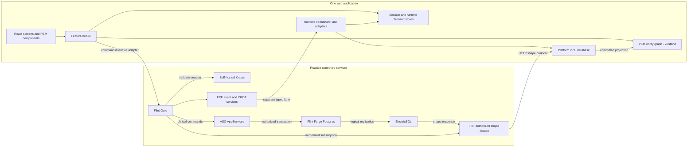
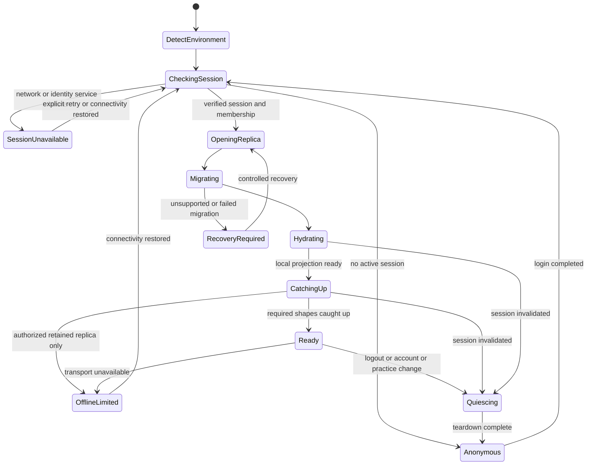
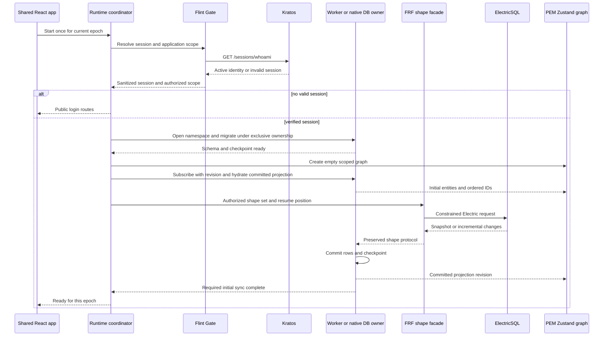
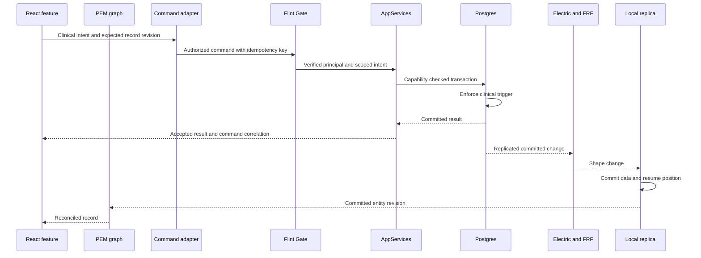
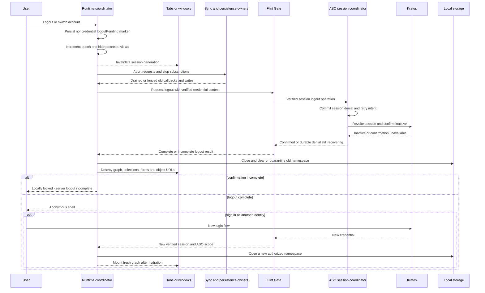
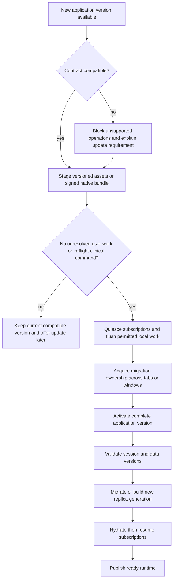

# Application runtime architecture: browser and Tauri

**Status:** Accepted architecture; the web Compose candidate is implemented and locally integrated, while release and native certification remain open.
**ADR reconciliation:** 2026-09-09; see the [complete ADR index](README.md).
**Date:** 2026-09-06.  
**Scope:** Prior Authorization Workbench, Flint Forge, Flint Gate, Flint Realtime Fabric, Prometheus entity management, and self-hosted Ory Kratos.  
**Phase:** Accepted design from `web-ui-architecture`; implementation proceeds through `runtime-architecture`. Canonical position and completion remain in `.kbd-orchestrator/current-waypoint.json`; this design does not duplicate mutable task status.

**Web-first execution overlay (2026-09-16):** The normative [Web Case-to-Letter Workflow Contract](web-case-to-letter-contract.md) governs the current child. Complete and certify the browser workflow through `web-17`, then complete safe browser updates in `ra-20` and browser runtime certification in `ra-22`. Tauri SQLite parity and native updater certification resume only after the browser result is Passed. Existing desktop wrappers remain required command-contract parity, but native runtime evidence cannot block or substitute for browser evidence.

## 1. Decision and the difficult tradeoff

Use one React application in `web/`, one normalized Prometheus entity graph, and one explicit session/runtime lifecycle. Select platform adapters at application startup. Browser storage uses PGlite in a worker. The preferred production desktop target uses host-owned SQLite with typed Tauri commands. Keep PGlite-in-Tauri as the initial parity baseline until native replication and query adapters pass the same contracts.

Realtime relational data follows **Postgres → ElectricSQL → Flint Realtime Fabric's authorized shape facade → local database → Prometheus entity graph → React**. The graph is already a Zustand vanilla store. Additional Zustand stores expose session, startup, update, and per-view interaction state; they do not duplicate clinical records.

**The uncomfortable thing:** choosing native SQLite improves desktop ownership and persistence integration, but adds a second SQL dialect and a replication adapter that does not yet exist as a complete solution in these repositories. A shared Zustand API cannot conceal missing transaction, hydration, migration, or authorization semantics. If native parity is not demonstrated, ship the worker PGlite path first rather than claiming SQLite is a drop-in replacement.

This design preserves clinical authority in gateway policy, `AppServices`, and Postgres triggers. Neither a local SQL write nor a Zustand action can affirm a gate or sign a letter.

## 2. Workspace and evidence baseline

The table records the original architecture assessment. Later implementation
updates through RA-10 supersede the corresponding session, gate-transport,
signing, shape-facade, revocation, scoped graph, committed projection and query
cache observations without certifying the remaining target architecture.

Open [prior-auth.code-workspace](../../prior-auth.code-workspace) to work across all five folders. The four companion folders are references to existing repositories, not copied source, Git submodules, or package-manager dependencies. The file does not alter Codex sidebar/project settings. Relative paths assume the current sibling layout beneath `Projects/`.

| Repository | Responsibility in this design | Observed source and limitation |
|---|---|---|
| `prior-auth` | Shared UI, application startup, domain services, clinical policy integration, deployment composition | The mounted web stack uses self-hosted Kratos, restricted runtime/authority PostgreSQL roles, Gate, Electric, FRF, PGlite and the scoped PEM graph. The Compose demo enables the qualified memory-only materializer explicitly; persistent browser storage remains a release decision. The host owns durable document tasks and routes synthetic inference through Liter-LLM without a production-PHI fallback. `desktop/src-tauri` mounts the pinned Tauri core command surface in the mock runtime; a production Wry window remains unqualified. |
| `flint-forge` | Practice Postgres substrate; database access, RLS and Cedar capabilities where Forge services are used | `crates/fdb-gateway/src/bootstrap.rs`, `authz_mode.rs`, and `crates/fdb-postgres`. ASO currently composes Forge's Postgres image; this does not prove every Forge API is on the ASO request path. |
| `flint-gate` | Public entry point, Kratos session validation, policy, downstream identity projection | The RA05 local stack proved the Gate→FRF authorized facade path. RA06 and its repair children now use fresh ASO authority decisions and a durable shared fence across Gate replicas; final phase certification remains separate. |
| `flint-realtime-fabric` | Authorized realtime facade; relational shape routing plus separate event/CRDT lanes | The Electric shape proxy and RA06 final-frame lease have bounded local evidence. Local SQL materialization remains ASO RA11c work; full assembled phase certification remains separate. |
| `prometheus-entity-management` | Framework-neutral entity graph, React hooks/components, persistence and realtime adapters | Core `graph.ts` uses `zustand/vanilla`. PGlite and Tauri SQL adapters store serialized graph snapshots. They are not database replication engines. |
| Self-hosted Kratos | Identity, authentication flows, session lifecycle | Compose names a Kratos image; no live deployment/version capability test was performed. Ory Network-only features are not assumed available. |

Source reading takes precedence over comments that claim a completed integration. In particular, PEM's `adapters/electricsql.ts` forwards shape changes to graph subscribers and listens for SQL notifications; its inspected implementation does **not** insert the shape rows into PGlite. Its header diagram alone is insufficient evidence of database hydration.

The installed app declares React 19.2.0, Zustand 5.0.8, PGlite `^0.5.8`, and
Electric client `^1.5.27`. Operator decision `G-PIN-RA09-APPROVED` makes
`versions.toml` authoritative for the reviewed PEM core/react candidate
`4.0.3-ra09.0.g071b9e5.s8179d23348ab`; `web/package.json` consumes its exact
repository-vendored tarballs. The adoption verifier confirms one installed core
singleton and 107 shared public export identities. New sync or Tauri packages
still require their own verified compatible pins.

## 3. Deployment topology and trust boundaries

The facade is an HTTP proxy for Electric's protocol, not a conversion of shapes into arbitrary Iggy events. Electric retains responsibility for shape snapshots, handles, offsets and refetch semantics. FRF owns the authorized exposure and lifetime of those subscriptions. Its existing broker/CRDT services remain separate lanes. This implements the requested routing through the fabric without creating two competing streams for the same clinical row.

The gateway and facade derive practice membership, permitted entities, columns and predicates from verified server context. Client `where`, table names, or a Zustand practice ID are never sufficient authorization. Strip or reject client attempts to broaden shapes. Preserve Electric protocol headers, streaming behavior, continuation parameters and errors through the proxy. Authorize continuation requests too; do not expose the upstream Electric port to clients. This follows Electric's documented proxy-auth pattern. [Electric authentication](https://electric.ax/docs/sync/guides/auth)

Use the current base-table projections and server-maintained `practice_id` columns. Do not reintroduce SQL views as replication sources: this project's live investigation found both ordinary and materialized views unsuitable for its Electric path. Client schema omission is useful but cannot prevent sensitive fields from arriving on the wire. Server column/row authorization is mandatory.

## 4. One application, explicit environment adapters

The composition root selects a browser or desktop adapter once. Tauri provides `isTauri()` in `@tauri-apps/api/core`; follow detection with a typed host capability/version handshake. The detected environment is a routing fact, not an authorization claim. Avoid user-agent checks and scattered conditionals in feature components. [Tauri core API](https://v2.tauri.app/reference/javascript/api/namespacecore/)

| Concern | Browser | Tauri desktop |
|---|---|---|
| Authentication credential | Secure HttpOnly Kratos cookie via same-origin proxy | Native host owns opaque session token; webview receives a sanitized session projection |
| Local database | PGliteWorker; IndexedDB initially, OPFS after measurement | Preferred: SQLite owned by trusted Rust host; PGlite worker parity baseline |
| Relational replication | Electric protocol via Gate/FRF into worker tables | Same protocol via Gate/FRF into host SQLite, using a new transactional materializer |
| Clinical commands | Feature API → Gate → ASO services | Typed IPC → trusted host request → Gate → authoritative ASO service; preserve the same domain command contract |
| Presentation | Same routes, hooks, PEM components and graph selectors | Same, with desktop chrome and native capabilities injected |
| Code updates | Versioned web assets and coordinated reload | Signed native package containing matching frontend/host versions |

Proposed application-owned contracts: `RuntimeEnvironment`, `SessionAdapter`, `LocalReplica`, `RealtimeAdapter`, `CommandTransport`, and `UpdateCoordinator`. These names describe design interfaces, not existing exported APIs. Their contract covers open/migrate/hydrate/subscribe/stop/close, readiness, cancellation and session ownership; it must not expose arbitrary SQL to feature components.

Refactor the existing PGlite-specific timeline API behind typed repository operations during implementation. Browser and desktop repositories return identical domain records and ordered IDs, even if their SQL differs. Shared code must not import Tauri plugins with startup side effects; desktop modules are loaded only by the desktop adapter. An unavailable desktop bridge is an explicit startup failure, not permission to silently switch storage or inference lanes.

`aso-host` remains shell-independent. Tauri integration belongs in the desktop shell, while authorization and domain operations stay in shared services. The native client must not contact a privileged database directly or supply an arbitrary `actor` as authority.

## 5. State ownership and the Zustand boundary

| State | Owner | Lifetime and write authority |
|---|---|---|
| Cases, evidence, citations, letters | Server records; local DB replica; one PEM graph per mounted session | Authorized server commits; local graph is their normalized projection |
| Ordered query results | PEM graph lists | IDs only; rejoin records at render |
| Session summary | Application session Zustand store | Verified identity, practice, session ID, assurance level and capabilities; never raw credentials |
| Startup and replication progress | Application runtime Zustand store | Coordinator writes; separate `databaseReady`, `localHydrated`, `initialSyncComplete`, connectivity and errors |
| Update state | Application update Zustand store | Compatible version, waiting update, safe-to-reload state |
| Selection, expansion, filter input | Per-view interaction Zustand store | Reset on case/session change; windows may disagree intentionally |
| Durable preferences | Preference entities in PEM | Scoped to user/practice/device as appropriate |
| Unsent clinical draft content | Local-only draft entities projected into PEM from a separate draft store | Bound to identity/practice; excluded from rebuildable replica tables and automatic command replay |
| Credentials and encryption keys | Browser cookie mechanism or trusted native host | Excluded from graph snapshots, plugin stores, logs and devtools |

The requested Zustand routing is primarily **routing into PEM's existing Zustand graph**. Do not add parallel `casesStore`, `documentsStore`, or `permissionsStore` copies. Use PEM hooks and components for entity reads and lists in both deployments.

[ADR-008](adr-008-shared-runtime-state-and-sessions.md) supersedes ADR-006 and records the non-durable session/runtime/update projections alongside the Zustand-backed PEM graph. Durable business data remains in the graph. [ADR-009](adr-009-authorized-replicas-and-updates.md) supersedes ADR-007 with FRF-mediated Electric access and the desktop storage branch. The original records remain explicitly historical.

The Tauri Zustand plugin is optional for non-sensitive shell coordination only. Its automatic graceful-exit persistence makes it unsuitable as the default wrapper for session, clinical, or per-view stores. The PEM Tauri plugin already offers graph IPC surfaces; do not enable both plugins as independent graph replication owners. [Zustand plugin persistence](https://tb.dev.br/tauri-store/plugin-zustand/guide/persisting-state)

## 6. PGlite methodology and desktop alternative

### Browser recommendation

Run PGlite outside the UI thread. `PGliteWorker` coordinates tabs around an elected database owner. Use an explicit stable worker-group ID per database namespace: the documented default includes the worker URL, which may change between application builds. Wait for initialization before migration or queries. Election of a replacement owner must also restart that owner's sync subscriptions exactly once. [PGlite workers](https://pglite.dev/docs/multi-tab-worker)

Start with IndexedDB persistence where device policy permits it. Evaluate OPFS AHP using representative data; it requires a worker and does not erase quota, eviction or access-policy concerns. Request persistent browser storage when appropriate, check whether granted, and handle quota/eviction explicitly. A cache lost to eviction can be rebuilt; unsent local work cannot be treated as equally disposable. [PGlite filesystems](https://pglite.dev/docs/filesystems), [StorageManager](https://developer.mozilla.org/en-US/docs/Web/API/StorageManager)

Unmanaged/shared browser sessions default to memory-only storage. Durable clinical replicas require a defined device and privacy policy first. Even IDs and document names can be sensitive in context; an approved projection must not be described as automatically anonymous. Browser storage is not a secure credential vault or an authorization mechanism.

Use a real Electric-to-table materializer. The PGlite sync extension supplies `syncShapesToTables`, persistent sync keys, an initial-sync callback and transactional application across subscribed tables; it is currently documented as alpha. It does not synchronize local writes back to the server or resolve their conflicts. Treat version compatibility and scale as acceptance gates. [PGlite Electric sync](https://pglite.dev/docs/sync)

For this application, choose one owner: materialize relational changes in SQL, then project committed rows into PEM. Do not also feed the same raw shape directly into the graph. The database and graph would otherwise observe different orderings and incomplete snapshots. Worker-owned extension initialization and its status messages require a verified bridge; extension APIs are not all automatically exposed on the main-thread worker proxy.

### Desktop decision

| Option | Benefit | Cost / condition | Decision |
|---|---|---|---|
| PGlite in Tauri worker | Closest parity with browser SQL and Electric materializer | WASM engine and webview storage remain; multi-window behavior needs OS-specific proof | Initial baseline and fallback deployment choice |
| Host-owned SQLite | One native owner across windows; controlled file lifecycle; natural native migration/backup integration | New Electric materializer and SQL repository parity; encryption/key handling are separate work | Preferred production desktop target after parity gates |
| Bundled PostgreSQL service | PostgreSQL query compatibility | Service lifecycle, upgrades, credentials, ports and installation burden | Not justified for the desktop replica |
| Graph snapshot only | Simple reopen using existing PEM adapters | No durable relational rows or atomic stream checkpoint; cannot support current SQL reads correctly | Insufficient for the requested application |

PEM already exports `createPGlitePersistenceAdapter` and `createTauriSqlPersistenceAdapter` from core. Both implement snapshot get/set/remove. Their existence supports an adapter seam, not native Electric replication parity. Likewise, the PEM Rust graph plugin currently keeps in-memory mirrors; it is not a durable database merely because it has snapshot commands.

For SQLite, apply each accepted replication batch and its resume checkpoint in one host transaction, then publish a committed graph revision. Only that host owns writes/migrations. Renderers use scoped typed commands. The official SQL plugin provides SQLite and transactionally applied migrations, but exposing general `execute` permission is not the desired clinical trust boundary. Its existing PEM persistence adapter can inform a narrower host adapter. [Tauri SQL](https://v2.tauri.app/plugin/sql/)

PGlite and SQLite do not share data files or migration SQL. They share logical schema versions, domain serialization, replica checkpoint semantics and contract tests. Normalize timestamps, UUIDs, nulls, JSON, booleans and large integers explicitly; preserve identifiers as strings. Migrations are backend-specific implementations of the same logical change.

## 7. Startup and hydration protocol

Public login/recovery routes mount without a database. Authenticated routes mount only after a verified session and usable graph exist. This prevents the current null-session loading boundary from becoming an endless spinner around the login screen.

The coordinator owns a monotonically increasing `sessionEpoch`. Every async result, subscription callback and persistence job captures it and may publish only while it remains current. The persisted namespace is based on deployment, practice, identity, authorization-scope revision and replica generation; the transient epoch prevents old work from crossing a session transition. Do not key private storage only by practice ID.

Offline access defaults to **no protected rendering once authorization cannot be revalidated**. `OfflineLimited` therefore shows a locked public shell by default. Any future offline-viewing exception requires a server-issued, scope-bound grant with an explicit deadline no later than session expiry, allowed data classes and allowed assurance level. Lock on expiry, clock rollback uncertainty or a known revocation. Signing and affirmation remain online-only. A disconnected client cannot learn a new server revocation instantly; that is the explicit cost of any nonzero offline grant, which is not enabled by this design.

1. Render the public shell and obtain platform capabilities. Load only non-sensitive deployment configuration.
2. Validate the credential through Gate/Kratos and resolve authoritative ASO membership/capabilities. Distinguish an invalid session from an unavailable identity service. No protected replica is opened for an anonymous user.
3. Obtain the compatible application/API/schema/shape contract. Select the authorized storage namespace and persistence policy.
4. Acquire the database owner and migration lease. Open storage, await readiness, validate metadata and run supported migrations before starting sync.
5. Create a fresh scoped PEM graph. Hydrate it from committed local SQL. A serialized graph snapshot may accelerate startup only when its namespace, schema, projection version and checkpoint match the SQL replica; otherwise rebuild it.
6. Establish projection listeners with a revision handshake, then read the initial projection. Buffer or replay commits after the captured revision so no change falls between hydration and listener installation.
7. Start/resume the required Electric shape set through FRF. On a cold start, wait for its complete initial snapshot before presenting that view as current. On a warm start, authorized local data may be shown as “Updating” under the retention policy.
8. Enable a screen when its required data set is coherent. “Database opened,” “graph hydrated,” and “server caught up” are different states. Clinical actions always require current server validation.
9. Start optional event/presence subscriptions after the core read path is ready. Their failure should not masquerade as relational data loss.

RA11c owns the real materializer caller that turns replica grant revalidation failure, authority timeout or a changed session/grant tuple into the shared RA06 session-revocation event. That caller fences its captured generation before committing SQL, advancing a checkpoint or publishing a PEM batch. RA06 owns the immediate Zustand access fence. RA13 owns foreground/resume revalidation and draft recovery; it does not duplicate the materializer or server denial journal.

That RA11c caller remains an implementation and qualification path. The normal
GraphProvider does not start it; only
`VITE_ASO_ENABLE_RA11C_MATERIALIZER=experimental` opts a local build into the
blocked candidate. Production browser adoption requires a later decision that
passes or replaces the fixed PGlite RSS gate.

PEM's `startLocalFirstGraph` returns `ready`, `dispose`, `hydrate` and `persistNow`. Its current `ready` means its graph hydration/replay routine completed; `isSynced` is based on pending actions, not an Electric freshness guarantee. The runtime must maintain its own relational sync readiness. The current implementation also has module-global pending actions and sync status. Scope them per runtime in PEM before supporting account replacement without a full process reload. Disposal currently unsubscribes but does not provide an async barrier for every in-flight persistence operation; the new lifecycle contract must.

React StrictMode mount/unmount behavior must not create two owners or let a late open resurrect a disposed session. Resources belong to the runtime coordinator, with explicit acquisition, cancellation and disposal; providers expose the selected runtime rather than independently opening databases.

## 8. Realtime consistency and writes

All relational sync uses the commit-first projection path. For initial multi-table hydration, maintain referential consistency across the screen's required tables; do not expose half a citation/document relationship as a final “void.” Keep `met`, `gap` and `void` distinct from “not loaded.”

SQL atomicity must extend to graph publication. Prepare the full entity additions/updates/deletions and affected ordered lists for one coherent database revision, then publish them with one atomic PEM store update. Subscribers must see either the previous complete projection or the next one, never a partially updated relationship. React batching alone is insufficient because imperative subscribers also observe Zustand. If PEM lacks this batch surface, add it as a core contract before wiring replication; verify it with subscriber traces as well as rendered screens.

On shape resume, the persisted rows and checkpoint must describe the same commit boundary. If the Electric handle expires or the server requests refetch, rebuild the affected replica generation and swap the projection after completion; remove stale rows rather than merging a new snapshot into old data indefinitely. On application foreground/resume, RA13 keeps protected content locked until an authoritative session/practice/revision check succeeds. Bound snapshot sizes by authorized working sets. Measure initial-sync memory before increasing them.

RA-02 gate operations use a command ID and persisted result lookup for idempotency and reconciliation. Within an identity and selected practice, command reuse is resolved before the payload's target-case authority check, so changing the case, kind or action yields one stable conflict even when that changed case is missing or outside the practice. Cross-identity receipt lookup remains unavailable.

RA-03 signing accepts no caller-selected actor or signature. It binds the command to expected letter, QA and current signature revisions and stores the authoritative result in an immutable identity/practice-scoped ledger. Gate, `AppServices` and PostgreSQL each refuse the wrong principal or scope; the service and database independently refuse stale revisions, incomplete QA and incomplete sources. An exact repeated command is resolved from the persisted result before mutable letter state is read, and `GET /api/letters/{letterId}/sign/commands/{commandId}` reconciles a lost response without another clinical effect.

Approval also freezes the claim set and every cited document version through
database triggers and shared transaction locks. Approval is terminal except for
the transition to signed; a QA row cannot be moved away from an approved letter.
Approval takes relation locks that conflict with QA and claim truncation, then
revalidates the complete QA set, requires every included claim to resolve a
source document, positive page number and source date, and rechecks that
provenance before binding its revision. Annotation and criterion links remain
auxiliary attribution and cannot replace the source. Corrected source
content is a new document row and a new letter revision, so signing cannot
accept changed document content under an old approval. Before
any separately committed server migration runs, and again afterward, the
migration entry point refuses all-table, `aso` schema or explicit-table
publications that capture local command ledgers. Migrations `2026090600` and
`2026090607` install the OID registry, DDL-start serialization, and end
validation before any command ledger can commit. Table DDL and publication DDL
take conflicting transaction advisory locks; a waiter aborts with `40001` and
must retry with a fresh catalog snapshot. The protected identity follows a
table across rename and schema moves, and explicit membership plus published
namespaces are checked. Removing an existing unsafe publication, checking
possible exposure and rerunning the checksummed migration set is the recovery
path.

Evidence reassessment follows the same command boundary. The timeline submits `commandId`, the selected `met`/`gap`/`void` state and its observed `assessedAt` timestamp to `POST /api/cases/{caseId}/evidence/{evidenceId}/state`, including the selected practice on both mutation and lookup. Gate requires `annotate`; `AppServices` and PostgreSQL independently enforce the verified human, practice, resource and current-revision checks. The database commits the new state, surgeon attribution, audit event and immutable result together. Explicit lookup reconciles an uncertain response. A runtime command registry keys ownership by feature, verified identity, selected practice and case. It survives route navigation and hook unmount/remount, hides another scope's feedback, and continues to refuse mutation in the original scope until the matching command reaches a definitive result or successful lookup. It waits for the authorized relational projection to change rendered entities, writes neither PEM nor local SQL, and enqueues no PEM replay action. The registry is memory-only; process restart recovery remains outside this task and cannot be claimed as implemented.

Attributed annotations use `POST /api/cases/{caseId}/annotations/{annotationId}` and the matching command lookup route, with one-for-one desktop wrappers. The request carries a stable command and annotation ID, clinical content, a projected server-owned annotation-type ID, one optional evidence or document target, include/hold disposition, and expected revision. It carries no actor or practice authority. The verified session supplies attribution; Gate policy, `AppServices`, and PostgreSQL independently require a current human membership with `annotate`. One transaction writes the current annotation, an immutable revision, an immutable command result, and an audit event. Projection revision 3 introduced the attributed opinion fields and the approved `annotation_types` reference catalog containing only `id`, `key`, `name`, and `description`; current projection revision 6 retains them, the exact case-scoped document status projection, and the sanitized document-task status projection. Type-specific JSON Schema, annotation `data`, source text, embeddings, task inputs/results/errors/actors, and all ledgers remain server-side. The client applies no optimistic clinical row change and reconciles uncertain outcomes by command lookup before waiting for the graph projection.

Gate policy keeps target-reader outages distinct from clinical denial: typed
unavailable and native-authentication-unavailable results return `503`, while
typed denial or hidden-not-found results return `403`.

The web-server composition fails startup unless `ASO_DATABASE_URL`,
`ASO_GATE_DATABASE_URL`, `ASO_SESSION_AUTHORITY_DATABASE_URL`,
`ASO_KRATOS_PUBLIC_URL` and `ASO_KRATOS_ADMIN_URL` are all configured. The three
database URLs must identify the same host, port and database. Session reads,
clinical writes and logout-journal transitions use separate restricted credentials.
Only the server process receives the Kratos administrative endpoint; the browser
and desktop renderer never receive it. The restricted PostgreSQL repository supplies every mounted clinical command port. Its memory
adapters compile only for tests; criteria has an explicit stateless unavailable
port until its authoritative read adapter is scheduled. Fresh and upgrade
fixtures force the final signing and reassessment receipt inserts to fail and
observe rollback of the clinical row and audit before retrying the same command
successfully. The actor-less evidence-count endpoint is absent from production
router composition and requires verified-context conversion before it can be
mounted.

A local pending indicator is permitted; a locally predicted signed or reassessed state is not authoritative. One scope has one mutation slot. A definitive success, refusal, conflict or successful lookup clears its matching command correlation. A network exception, HTTP 408 or HTTP 5xx response retains the correlation because the command may already have committed. Do not replay signing, gate affirmation or reassessment automatically through PEM's generic offline-action mechanism.

The FRF event lane may carry presence, task progress or CRDT document changes under separate typed contracts. For a relational clinical entity, those events can request resynchronization but cannot race Electric as a second writer. CRDT documents require their own privacy classification and citation/signing boundary; realtime transport alone does not grant editing authority.

## 9. Kratos session architecture

### Browser

Use Kratos browser flows through a same-origin public proxy with secure cookie handling, credentials and CSRF protection. Login begins at `/self-service/login/browser`; submit the returned flow's UI/action contract, preserving validation errors and flow expiry handling. Session inspection uses `/sessions/whoami`. Do not use native `/api` flows in a browser SPA to avoid cookie/CSRF requirements. [Ory browser versus native](https://www.ory.com/docs/identities/native-browser)

Expose only the Kratos public surface. Administrative identity APIs stay server-side. The app session operation combines verified Kratos identity with ASO membership and clinical capabilities. RA-01 implements this application operation as GET `/api/session`; Kratos supplies identity validation, while ASO supplies current membership and capabilities. Roles and practice membership do not become trusted merely because they appear in user-editable identity traits.

### Tauri

The trusted Rust host performs native flow requests and owns the resulting
opaque session token. The selected facility is `keyring` 4.2.0, backed by
macOS Keychain, Windows Credential Manager or freedesktop Secret Service;
`secrecy` 0.10.3 protects the transient host value. There is no plaintext
fallback. Ordinary SQLite, JSON, Stronghold's renderer-callable command surface,
PEM and Zustand are not credential stores. `/self-service/login/api` starts a
Kratos 26.2.0 native flow and `/sessions/whoami` validates the token before it
is stored. The renderer receives session ID, identity ID, expiry and assurance
only. The macOS password-flow path has synthetic local evidence. Closed Tauri
commands now check the calling window and access epoch, obtain the credential
inside the host, and forward all eleven clinical operations to Gate. A
sanitized host event advances the access epoch and locks every renderer on
logout, verified scope replacement or authentication failure; two mock-runtime
windows receive the same event. A production Wry window, production
multi-window behavior and other operating systems remain RA17 work. See
[ADR-010](adr-010-native-session-credentials.md) and
[Ory's session model](https://www.ory.com/docs/kratos/session-management/overview).

For SSO, use the system browser through Tauri opener 2.5.5 and return through
deep-link 2.4.10 with single-instance 2.4.4. The host validates the callback
scheme, path, state and active ceremony before a one-time Kratos exchange. A
long-lived session token never travels in the URL, and the webview is not
assumed to share system-browser cookies. The current self-hosted configuration
does not enable an OIDC provider or callback, so this selected mechanism is not
an activation claim.

Gate’s general Kratos authenticator forwards Cookie and Authorization and does not explicitly forward `X-Session-Token`. RA-02 gate routes instead use passthrough authentication and the mandatory `aso_clinical_authorize` hook, which forwards exactly one original Cookie, Authorization or X-Session-Token credential to ASO for fresh validation. RA17's typed desktop transport now reaches those routes with a host-owned `X-Session-Token`; its local evidence covers command dispatch and transport parity, while deployed Gate and physical-window qualification remain open.

### Fabric credential bridge

FRF's verifier checks JWT signature/JWKS, audience and configured issuer, and requires a tenant claim. An opaque Kratos token cannot be decoded as that JWT. Use Gate's existing minting capability after Kratos validation, deriving membership server-side and signing an audience-bound, short-lived downstream token. Keep this token server-side when proxying the fabric. Strip untrusted inbound identity headers before constructing downstream claims.

The credential bridge must bind deployment, Kratos issuer, verified Kratos session ID, subject, practice, human/agent principal kind, assurance, scopes, ASO authority incarnation/revision and expiry. A downstream token `jti` is not the Kratos session ID. Session caches use a one-way credential fingerprint and retain the verified session ID; replica grants remain tenant-qualified. Existing Gate token-exchange code rejecting Kratos as an OAuth subject provider is not a reason to treat an opaque session as an OAuth access token.

Self-hosting has no automatic entitlement to Ory Network's global session cache. Use one deduplicated frontend session check at startup and on revalidation triggers. Gate may cache identity validation through session expiry, but every protected authorization performs a fresh ASO authority-fence decision for the verified session and selected practice. Redis is a shared coherency fence rather than authority. A restarted Gate bootstraps the current ASO incarnation/revision and all unexpired denials from one repeatable-read snapshot, then replays the durable outbox past its high-water mark before enabling L1/L2 use. A running Gate probes that high-water mark at least every 250 ms and disables caches on lag, Redis loss or regression. Short JWT expiry alone is not immediate logout.

ASO stores two durable authority identities. Session denial uses deployment ID, Kratos issuer and verified session ID and remains through the original expiry plus skew. Membership/capability authority uses deployment ID, ASO incarnation and monotonic global authorization revision; the revision and event commit together. Within one incarnation only a greater revision advances state. A changed incarnation requires a fresh ASO bootstrap and invalidates the old cache namespace. Delayed or duplicate events cannot lower the fence.

### Session state and transitions

The session store contains a discriminated state: `checking`, `anonymous`, `authenticated`, `reauthRequired`, `switching`, `unavailable`, or `loggingOut`. Only `authenticated` carries a current verified scope. A network failure is not proof that the user logged out. A stale stored session summary is not proof that they are logged in.

RA13 owns authoritative revalidation on foreground/resume, reconnect, expiry approach, completion of login/settings/reauthentication, an authenticated request rejection, and cross-tab session notifications. Coalesce concurrent checks and keep protected content locked while a foreground/resume result is unresolved. Do not treat every HTTP 403 as logout: it may mean insufficient assurance or a denied domain action. Route password recovery, verification and settings through Kratos flow contracts; re-read the session afterward. Session extension may require reauthentication rather than an invented refresh token. [Ory session refresh](https://www.ory.com/docs/kratos/session-management/refresh-extend-sessions)

Browser logout must invoke the shell-neutral server logout coordinator, not merely clear React state or call Kratos directly. Local locking happens immediately. Before the request, RA13 persists an origin-scoped, noncredential `logoutPending` marker with a generation and notifies other tabs. The server coordinator resolves the verified session, commits ASO denial and retry intent, then asks Kratos to revoke and confirms inactive state under a bounded lease. Retry and confirmation writes require the matching lease to remain live when the worker observes its result. A crash before the denial commit produces no success. A crash after commit leaves the session denied and retryable. A crash after Kratos succeeds repeats confirmation idempotently. HTTP and the injected Tauri operation report success only after confirmation is marked complete; an incomplete result keeps the client locked while the ASO recovery runner continues. All membership and session-denial outbox allocations serialize on the authority singleton through commit, preventing a replay cursor from skipping an uncommitted lower sequence.

Check `logoutPending` before automatic session restoration on every reload/new tab. It carries no token, identity or clinical content and is separate from graph and Zustand persistence. Clear it only after confirmed revocation or an explicit fresh login ceremony that resolves the old session; a successful passive `whoami` must never clear it. If storing the marker fails, report that cross-reload local locking cannot be guaranteed and require online logout before claiming completion. Native host storage maintains the equivalent marker. ADR-010 selects the production native credential facility; RA17 still owns its mounted logout and command parity. Credentials stay in their protected cookie/host facility. [Ory logout flow](https://www.ory.com/blog/login-spa-react-nextjs-authentication-example-api-open-source)

The revocation measurement starts at the authoritative ASO membership commit, durable session-denial commit or verified expiry instant and ends at the final protected body frame produced by FRF or cancellation that prevents the next frame, followed by denial of a subsequent protected request. The ceiling is 5,000 ms. FRF revalidates at most every 750 ms, bounds the authority RPC at 750 ms and propagates cancellation within 250 ms. The claim excludes kernel/proxy buffering, network transit and client receipt. For a revocation initiated directly in Kratos, the application clock begins at the first mounted server observation because it cannot observe the earlier external action; that trusted observation commits the same ASO denial before reuse.

The React/Zustand boundary has a stricter local ordering rule: logout, membership loss, expiry or the RA11c materializer's replica-failure event synchronously advances the access epoch and removes protected content before exit motion or another command. Wide and compact layouts reuse the same command owner during resize. This local fence does not replace the server authority decision.

An identity change within the same practice still destroys the old graph. A practice change within the same identity also tears down the replica scope. Browser cookies are shared across tabs on the same origin: default to one active identity/practice context and broadcast invalidation hints, followed by authoritative checks. Hints contain no credentials or records. Tauri uses one host session owner and native invalidation events across windows. Suspended tabs must check the current epoch/session before resuming protected rendering.

The cross-user leak to prevent is a late shape callback, hydration promise, debounce save, attachment URL or offline action from user A becoming visible or executing as user B. Namespace separation, epoch fencing, drained writes and fresh stores are all required; resetting a few Zustand fields is insufficient.

## 10. Migrations, replica generations and recovery

Track separate versions for server schema, logical client replica schema, storage-engine format, graph snapshot format, shape/projection contract, and application/host API. Matching package versions alone do not establish data compatibility.

Use an application-owned migration ledger containing migration ID, checksum, applied time and resulting logical version. Apply ordered migrations transactionally where the engine supports the operation. Refuse checksum drift and a schema newer than the client understands. An incompatible engine-format upgrade uses a supported export/reimport or a new replica generation; do not assume SQL migrations can upgrade every PGlite/Postgres storage format.

Migrate before subscriptions and hydration. Under browser leader election, acquire an exclusive schema lease and require other tabs to quiesce; the same database must not have old and new writers. A tab that cannot cooperate blocks an in-place breaking migration. For a read replica, a new namespaced generation allows a safer rebuild and atomic handover. Desktop uses a single native owner and closes or pauses renderer operations before migration.

Replicated relational rows can be rebuilt from the authorized source. Separately retain or explicitly resolve genuinely unsent draft work; never wipe it as part of “clear cache.” Signed letters and affirmations remain server-authoritative. Snapshots and replication checkpoints are versioned together with their namespace. On corruption, incompatible snapshot format, expired shape or a narrowed authorization scope, rebuild the eligible replica and discard stale projection rows.

Unsent drafts use a separate local-only draft store with its own schema and identity/practice namespace, outside disposable replica generations. Its records are draft entities in PEM, preserving the single entity model. Persist them only where the approved browser/native storage policy permits private data; otherwise keep them in memory and block a routine update/reload until the user saves through an authorized service or explicitly discards them. A session switch first fences draft autosave, then closes and quarantines the old draft store before clearing the graph. The next user cannot load or submit those drafts. The original user may recover them only after fresh authorization and an explicit review; recovery never replays signing. If emergency logout or revocation interrupts an in-memory unsaved draft, security takes precedence and loss must be disclosed rather than claiming durable recovery. Generated draft assertions still require document/page/date citations before inclusion in a letter.

No client obtains a full server database dump to accelerate startup. Prebuilt data may contain only approved public reference records, with a version and integrity manifest. Private hydration always follows verified scope. Provisioning SQL under `docker/bootstrap/` is not an upgrade runner for already-existing installations; server migrations need their own deployment job and rollback plan.

## 11. Application and data updates during runtime

Data updates continue through the database-to-graph projection and do not require a page reload. Code updates are a coordinated lifecycle event. Publish a version contract with supported API, replica schema, shape contract, graph snapshot and native host ranges. The endpoint/manifest structure is proposed application work.

For web deployment, use immutable hashed assets, revalidated HTML and compatibility metadata, and retain previous chunks long enough for open tabs. If a service worker is introduced, let the new worker wait until the update coordinator approves activation. Unconditional `skipWaiting`/client takeover can combine old pages with new worker behavior. Cache static assets only by default; exclude sessions, authenticated APIs, clinical attachments and private shape responses. Service workers have installation, waiting and activation lifecycles that support this handoff. [Service worker lifecycle](https://developer.mozilla.org/en-US/docs/Web/API/Service_Worker_API/Using_Service_Workers)

Prompt for reload at a safe boundary; never discard an unfinished letter or interrupt an unresolved signing request. Check an idempotency result before allowing retries after restart. Runtime version checks also protect pages restored from browser history or sleep. Incompatible clients must stop protected work until updated; compatibility is not permission to keep a revoked session alive.

For Tauri, distribute matching frontend and Rust host versions in a signed package. The updater requires signed artifacts. Stage the package, finish or reconcile commands, flush allowed local state, stop sync, relaunch, then migrate under the new host. Do not independently hot-replace the privileged desktop JavaScript bundle from the website. Rollback is allowed only when the previous binary can read the current data version; otherwise restore an approved backup or rebuild the replica. [Tauri updater](https://v2.tauri.app/plugin/updater/)

Server changes use expand/migrate/contract: deploy additive schema/API support, publish compatible client versions, migrate replica generations, and remove old contracts only after the supported client window closes. Electric and FRF stream schema changes must be included in that window. Unknown domain enum values stop the affected projection with a compatibility error rather than defaulting to `met`, `gap` or `void`.

## 12. Security and operational invariants

- Classify each data lane and privacy class before exposing it. Local-only records and embeddings of local records never enter either the Electric or FRF egress path. No capability is inferred from a tool's description.
- Kratos authenticates identity; ASO membership and policy determine clinical permissions. Administrators and agents do not inherit a surgeon's signing capability. Recheck all three clinical enforcement layers on authoritative writes.
- Encrypt native private persistence with a deliberately selected storage/key strategy and restrict file/backup access. SQLite support alone does not imply encryption. Browser at-rest policy must account for XSS and shared devices; persisted session claims are never credentials.
- Restrict native IPC commands and target windows. The host validates session generation and scope on every sensitive invocation. No plugin mirror is treated as a trusted clinical command bus.
- Keep replica diagnostics to counts, durations, schema versions, anonymized correlation and error classes. Do not log rows, tokens, chart content or generated clinical text. Disable sensitive graph/devtool snapshots in deployed clinical sessions.
- Operate FRF's actual dependencies explicitly: broker, identity/JWKS, Keto where used, stores and CDC resources. If its CDC and Electric both consume Postgres, size and monitor replication slots, retained WAL and replay lag. Do not start duplicate consumers without a stated data lane.

These controls trace to real boundaries and named scenarios in this design: cross-account disclosure, widened shape requests, stale stream authorization, duplicate clinical commands, partial migration, stale snapshot replay and interrupted updates. This document itself implements no control. RA-01 through RA-10 now provide bounded evidence for the completed slices identified above; they do not certify the remaining assembled runtime.

## 13. Coordinated implementation sequence

| Order | Owner | Concrete refinement and exit condition |
|---|---|---|
| 1 | ASO + Gate + Forge | Define verified session/membership contract, privacy-approved replica schema and clinical command transport. Prove unauthorized users cannot broaden a shape or clinical action. |
| 2 | ASO + Gate + FRF | Persist session denials and membership authority events, enforce a fresh distributed authority fence, and hold authority through FRF body production. Prove cookie and injected native-token operation paths, reconnect authorization, final-frame cancellation and preserved Electric headers/checkpoints. |
| 3 | PEM | Scope pending actions, status and listeners to runtime; add cancellable hydration and drainable persistence. Define committed replica projection contract and snapshot/checkpoint validation. |
| 4 | ASO browser + PEM | Implement worker DB ownership, migration ledger, real table materialization, startup stages and coherent graph hydration. Keep public authentication routes usable. |
| 5 | ASO browser | Implement and certify the complete case-to-letter workflow and both denial-response paths under the frozen web contract. Every included generated assertion resolves document/page/date provenance. |
| 6 | ASO browser + deployment services | Add code/data compatibility metadata, safe browser updates, account switching and recovery; then certify the assembled browser runtime in RA22. |
| 7, deferred until browser Passed | ASO desktop + PEM | Resume Tauri session work, PGlite baseline, native SQLite materializer, typed repositories and native updater qualification. Certify each claimed native platform separately. |

The sequence is the implementation order. ADRs 008 and 009 record the accepted
target decisions; superseded records retain their history. Operator decision
`G-PIN-RA09-APPROVED` authorizes the current PEM pin change and exact vendored
candidate. Other dependency pins remain unchanged.

## 14. Acceptance matrix and measurements

| Scenario | Required observable result |
|---|---|
| Logged-out cold start | Public login usable; zero private database opens or shape subscriptions |
| Logged-in cold start | Migrations precede sync; required relational rows and graph projection agree before readiness |
| Warm startup | Correct namespace only; snapshot/version validation; local readiness is distinguished from server freshness |
| Account or practice switch during hydration | No old callback, write, pending action, attachment or entity appears in the new runtime |
| Logout with network failure, reload or new tab | Durable noncredential marker blocks passive restoration; explicit incomplete revocation; no silent cookie-based reentry |
| Offline grant absent or expired | Protected rendering locks; a saved session summary cannot extend access |
| Revocation while a nonempty stream is open | From ASO authority commit or verified expiry, FRF records the final server-produced protected frame or cancellation within 5,000 ms and the next request denies; client receipt is outside the claim |
| Replica authority fails in the real materializer | RA11c publishes the shared session-revocation event, Zustand locks synchronously, and the captured generation cannot commit SQL/checkpoint/graph output |
| Two browser tabs, leader closes | Exactly one replacement DB/sync owner; no missing or duplicated committed changes |
| Two desktop windows | One native DB owner; shared records agree, independent selection remains independent |
| Old tab versus new schema | Incompatible writer is fenced or upgrade waits; no partial in-place schema mutation |
| Crash between data and checkpoint | Resume does not skip records; replay is idempotent |
| Related entity/list projection batch | SQL and graph publication boundaries agree; no subscriber observes a partial relationship |
| Complete request workflow | Case creation, upload/processing, administering-entity resolution, criteria selection, met/gap/void evidence, request generation/review/signing and local submission acknowledgement succeed through the mounted browser path |
| Denial response workflows | Denial classification selects corrected resubmission or clinical appeal response; each resulting letter is generated, reviewed and signed through the mounted browser path |
| Generated assertion provenance | Every included assertion resolves a source document, positive page number and source date; incomplete assertions are excluded with the required message |
| Replica rebuild with unsent draft | Authorized original user can recover a separately retained draft; another identity cannot load or replay it |
| Expired Electric handle/refetch | Obsolete rows removed; snapshot becomes visible only at a coherent boundary |
| Native SQLite parity (deferred) | After browser Passed, prove the same normalized entities, null/date/ID semantics, list ordering and deletes as PGlite before claiming native parity |
| Lost command response | Idempotency reconciliation prevents duplicate clinical operation |
| Update with dirty user work | No forced reload or loss; after safe relaunch session and data are revalidated |
| Admin or agent attempts signing | Gateway, services and database enforce their independent controls |
| Browser quota/eviction | Explicit recovery state; rebuildable replica distinguished from unsent work |
| Native migration failure (deferred) | After browser Passed, native certification must prove explicit recovery without inferring it from browser evidence |

For the current milestone, measure cold/warm browser database-open time, migration duration, first coherent screen, initial shape catch-up, rows/sec, memory peak, UI responsiveness, stream lag, persisted bytes, user-switch teardown and multi-tab contention on representative synthetic practice datasets. Define pass thresholds before the certification run. Test the supported browser set with actual browsers. macOS/Windows/Linux webviews and native multi-window contention are measured later before any desktop support claim.

Application T0/T1/T2 gates belong to implementation changes. This document
receives structural/link/diagram checks and independent artifact review. Later
implementation changes retain their own evidence: RA17 task 1.2 records a
synthetic Kratos 26.2.0 and macOS Keychain run for the native credential
facility. Task 1.3 records typed Tauri dispatcher and mounted local Gate
transport parity for all eleven clinical operations. Task 1.4 records complete
typed refusal classification and two-window host invalidation in Tauri's mock
runtime. These results do not certify a production Wry window, OIDC, production
multi-window behavior, Windows or Linux.

## 15. Source map and remaining decisions

Local source roots are the folders named in the workspace. These are the principal inspected files for follow-up work:

- ASO: `web/src/main.tsx`, `web/src/app/providers/graph-provider.tsx`, `web/src/shared/store/interaction-store.ts`, `web/src/shared/sync/electric-shapes.ts`, `web/src/features/evidence-timeline/api/timeline-api.ts`, `desktop/src-tauri/Cargo.toml`, `desktop/src-tauri/src/native_session.rs`, `docker-compose.yaml`, ADRs 001–010 (006 and 007 are superseded history).
- PEM: `packages/entity-graph-core/src/graph.ts`, `local-first-runtime.ts`, `adapters/electricsql.ts`, `adapters/pglite-persistence.ts`, `adapters/tauri-sql-persistence.ts`, `packages/entity-graph-react/src/graph-store.ts`, and `packages/entity-graph-tauri/rust-plugin/src/state.rs`.
- FRF: `sdks/entity-management/src/adapter.ts`, `crates/frf-gateway/src/lib.rs`, `main.rs`, `crates/frf-identity-ory/src/verifier.rs`, `claims.rs`, and `crates/frf-postgres-cdc`.
- Gate: `crates/flint-gate-core/src/auth/kratos.rs`, `jwt_mint.rs`, `token_exchange.rs`, and `cache/mod.rs`.
- Forge: `crates/fdb-gateway/src/bootstrap.rs`, `authz_mode.rs`, and `crates/fdb-postgres`.

Maintainer documentation was consulted through Context7 and directly on 2026-09-06; links accompany the relevant design sections. Library documentation establishes available mechanisms, not proof that this application has integrated them. Repository comments mentioning other products or prescribing unrelated work are source context, not new requirements for ASO.

Remaining release decisions: approved persistent browser data set and
managed-device policy; selected Electric/PGlite sync versions; production OIDC
provider and allowed callback configuration; compatibility support window;
performance thresholds. Windows/Linux credential qualification, production
native-window qualification and native relational parity remain implementation
gates for later desktop claims, not for browser certification.
Distributed revocation, the PEM candidate and the macOS credential facility
have bounded local evidence. Final assembled browser certification depends on
the web child and `ra-20`; native platform certification remains deferred.

## 16. ADR scope and navigation reconciliation

[ADR-005](adr-005-navigation-and-gating.md) requires verified identity/practice,
permission to read the step, coherent runtime readiness and committed case gate
state. Steps 07–10 require an affirmed case gate. Action capabilities are
separate: an authorized coordinator can prepare a packet after surgeon
affirmation without acquiring the right to affirm or sign. A route flag or a
local optimistic record cannot create that committed authority.

The companion fabric ADR-009 records ASO integration restrictions: tenant-only
agent streams cannot carry protected output without subject/run visibility and
bounded revocation; cached room grants alone do not enable protected ASO media.
Fabric CRDT engines, FFI tooling and internal media ownership are distinct from
ASO replica storage. The standalone fabric admin-UI OIDC proposal does not make
Hydra an ASO prerequisite. See the [ADR index](README.md) for all scoped records.

## 2026-09-19 accepted extension — document-generation tasks

The [revision-12 implementation addendum](../handoff/web-case-to-letter-revision-12-agent-integration.md)
extends browser sequence step 5 after responsive UI acceptance. The local web
candidate now implements the host task service, Liter-LLM route, protocol
adapters and shared document surfaces; final web-17 certification remains
separate. Liter-LLM supplies
structured candidate prose through an internal authenticated synthetic Qwen route;
a distinct production PHI route remains disabled until US provider qualification.
There is no production-to-demo fallback.

One trusted host task service owns authorized retrieval, durable task/event state
in Flint Forge, revision capture, cancellation and atomic final letter/claims/QA/
audit persistence. The assembly kernel remains store-free. Inference and MCP
calls finish before final transaction locks; authorization and captured revisions
are checked again before commit. The engine's kind/version/package/content digest
is preserved separately from historical Markdown-only hashes.

AG-UI, A2A and MCP adapters use that same task service. Protected task/artifact
reads remain subject to current authority. Projection revision 6 publishes only
the sanitized task id, case, purpose, state, stage, sequence and update time
through FRF to PGlite and the entity graph; prompts, sources, artifacts, errors,
commands and actor identities remain structurally absent. Shared A2UI/MCP App presentation uses typed hooks
and scoped transient buffers, never an additional clinical writer. None of these
protocols can grant signing or affirmation. The exact protocol/dependency pins,
focused local protocol checks and a mounted browser projection proof are recorded
in the implementation; the complete positive/negative browser campaign remains
the web-17 gate.
