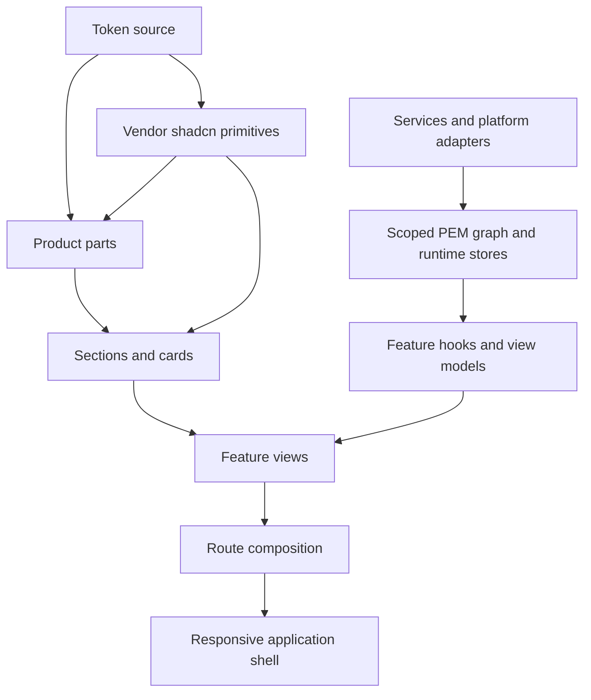
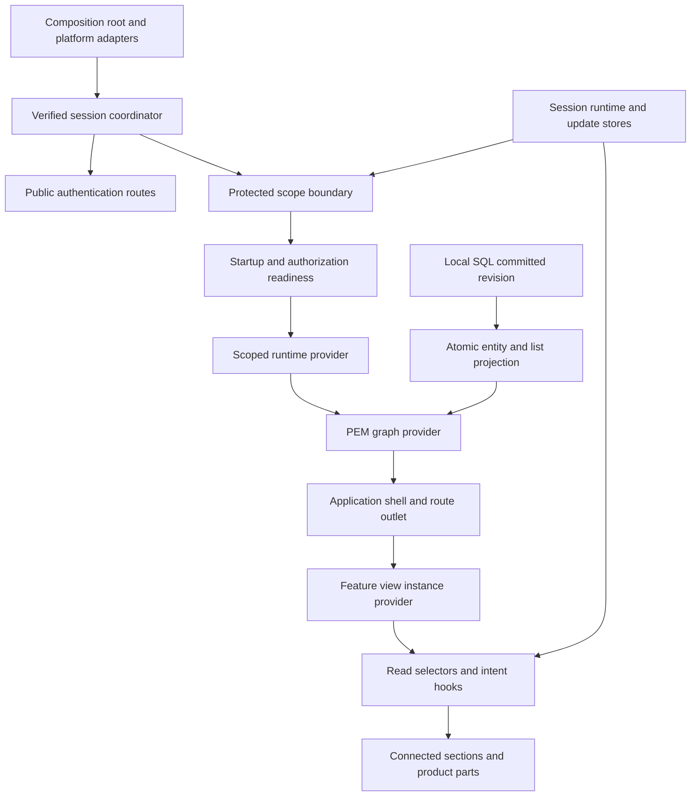
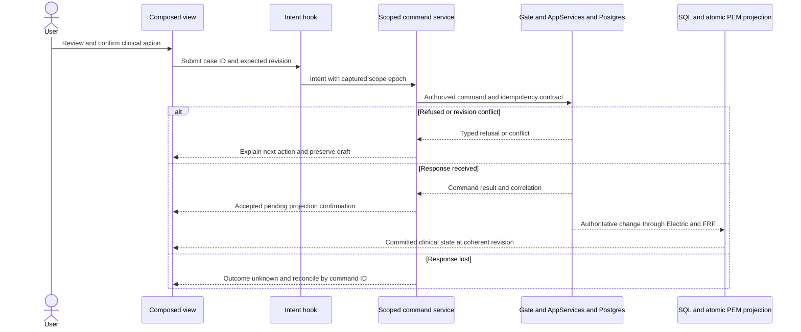
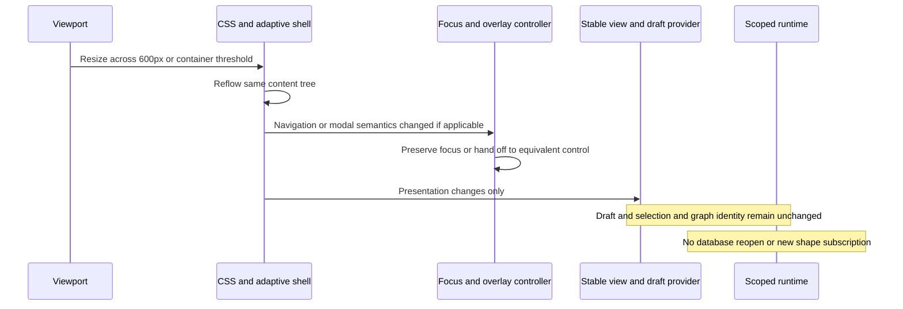

# React UI architecture: prototype, components and runtime

**Status:** Accepted architecture; the responsive web case-to-letter candidate is implemented, with final browser certification still open.
**Date:** 2026-09-06.  
**Authority:** Elaborates [ADR-004](adr-004-component-model.md), [ADR-005](adr-005-navigation-and-gating.md), [ADR-008](adr-008-shared-runtime-state-and-sessions.md), [ADR-009](adr-009-authorized-replicas-and-updates.md) and the [runtime architecture](application-runtime-architecture.md). It does not replace their ownership or authorization decisions.

**Current execution contract:** [Web Case-to-Letter Workflow Contract](web-case-to-letter-contract.md). Implement and certify the complete browser request and denial-response workflows before Tauri/native certification. Shared component and typed command contracts remain portable, but native evidence cannot block or substitute for the browser result.

## 1. Decision, scope and evidence

Build one React interface from shadcn primitives, product parts, composed sections/cards, feature views and an application shell. Parts and compositions are extensible through explicit children, typed contracts and feature adapters. They are not a generic JSON screen renderer or a second data framework. Browser, resized Tauri windows and phone browsers use the same feature contracts. This document does not select a Flutter UI architecture or certify Tauri mobile.

The [HTML prototype](../design/prototype/index.html) specifies visual hierarchy, clinical vocabulary and intended interactions. The inspected HTML files contain no `hx-*` attributes; interaction is primarily shell/page JavaScript and simulated actions. Those scripts are design evidence, not authorization or backend implementation. Reconstruct interactions using React and runtime contracts; do not run HTMX swaps or imperative prototype DOM mutation inside React-owned nodes. Preserve product workflows while replacing simulation with verified commands and coherent graph projections.

The uncomfortable failure is a visually faithful UI that loses a draft when a desktop pane becomes a phone dialog, renders old patient content during logout animation, or celebrates a signature before authoritative commit. Component identity, scope teardown, accessibility and command state are architectural requirements, not finishing polish.

### Inspected implementation versus target

| Evidence | Current observation | Required target |
|---|---|---|
| `web/package.json`, `web/components.json` | React 19.2.0, Zustand 5.0.8, React Router 7.9.1, Vite; shadcn `base-nova`, RSC disabled | Remain a shared client application; no Next.js migration or dependency changes in this design |
| `web/src/components/ui/button.tsx`, `dialog.tsx` | Base UI-backed primitives; other imported components must be inspected individually | Compose using the installed primitive API; do not assume every shadcn example uses Radix |
| `web/src/app/routes/app-routes.tsx` | Thirteen lazy product route entries, all under AppShell | Public authentication outside protected graph; explicit protected route requirements |
| `web/src/app/providers/graph-provider.tsx` | Owns migration-led PGlite startup, exclusive replica ownership, authorized FRF materialization, coherent graph projection and epoch teardown | Keep release storage policy and performance certification separate from the implemented memory-only Compose candidate |
| `web/src/features/evidence-timeline/hooks/use-evidence-timeline-projection.ts` | Reads coherent evidence/citation/document entities through graph selectors | Preserve the entity graph as clinical read owner; no per-hook record cache |
| `web/src/features/document-generation/hooks/use-document-generation.ts` | Owns one scoped AG-UI task channel and joins a sanitized FRF task-status projection from the graph | Keep provisional stream buffers separate from committed task/artifact state |
| `web/src/features/document-generation/components/document-blocks.tsx` | Shared shadcn draft, QA, claims and halt-memo blocks consumed by A2UI and MCP App renderers | Keep clinical signing, affirmation and submission controls outside protocol surfaces |
| `web/src/app/shell/app-shell.tsx` | Uses committed route/gate state, full-viewport overflow ownership and adaptive desktop/mobile navigation | Preserve route state, keyboard access, reduced motion and form identity during resize |

Existing code is a starting slice, not the template to duplicate unchanged. All new component and hook names below are **proposed application contracts**, except where explicitly identified as existing. Do not assume they are exports from PEM or shadcn. No new package API is established by an illustrative name.

## 2. Composition model and dependency boundaries

The three ownership layers in ADR-004 remain **vendor, library and feature**. “Part”, “card”, “section” and “view” describe composition size, not four additional technical directories. Application providers/routes/shell are composition infrastructure outside the reusable component library.



| Ownership/location | Responsibility | Allowed dependencies | Prohibited responsibility |
|---|---|---|---|
| Existing `web/src/components/ui/` | Vendor behavior and primitive semantics | Primitive libraries and generated styling conventions | Product policy, SQL, sessions or business mutations |
| Existing `web/src/shared/ui/` | Reused product parts and compositions, through props/children | Vendor components, tokens, shared domain display types | Opening stores, choosing platform or directly calling feature APIs |
| Existing `web/src/features/<feature>/components/` pattern | Connected sections and feature views | Feature hooks, product parts, vendor components | SQL, HTTP/IPC, singleton graph lookup or authority checks treated as enforcement |
| Existing feature `hooks/`, `model/`, `api/` pattern | Subscription contracts, derived presentation and intent services | Scoped stores, typed services and transports in downward order | React record cache, bypassing command authority |
| Existing `web/src/app/` | Providers, route assembly, navigation and platform composition | Feature entry points and runtime services | Clinical rules implemented in route flags |

Maintain feature ownership. A timeline-specific `EvidenceEntryCard` starts in the evidence feature. Promote only the reusable presentation contract when a second real consumer needs it. The existing `EvidenceStateChip`, `EvidenceCountsSummary` and `CitationChip` are reuse anchors, not a reason to build wrappers for every installed primitive. Route wrappers live in `app/routes`; feature views stay in feature `components`.

### Composition contracts

Use plain props for small display parts. Use compound components when siblings genuinely coordinate focus, disclosure, selection or form actions. Prefer explicit variants such as `SurgeonReviewSection` and `CoordinatorGapWorkSection` over one `CaseCard` with interacting `isAdmin`, `isEditable`, `isCompact` and `canSign` modes. Boolean facts such as `disabled` and `open` remain valid; the restriction is on Boolean feature configuration.

A compound provider exposes **state, actions and meta**. State is a read projection or a handle to a scoped store, actions express intent, and meta supplies accessible IDs, focus references and revision/readiness. A context carries stable dependencies; it must not broadcast the whole changing graph on every keystroke. Parts select the state they need through feature hooks. Simple presentational parts receive props and need no provider. These choices apply the Vercel composition skills and [compound-component guidance](https://vercel.com/academy/shadcn-ui/compound-components-and-advanced-composition).

Conceptual composition, not an existing JSX API:

```text
EvidenceTimelineView(caseId)
  EvidenceTimelineProvider(view instance, scoped runtime)
    ViewHeader(title, overall EvidenceCountsSummary)
    EvidenceFilterBar
    EvidenceCollection(ordered entry IDs)
      EvidenceEntryCard(entry ID)
        Header(CriterionLabel, EvidenceStateChip)
        Body(EvidenceSummary)
        Sources(CitationList)
        Actions(ObtainEvidenceAction OR RequestSurgeonArgumentAction)
    SourcePreviewController(selected citation ID)
```

Required citation and clinical state parts are enforced by the feature composition, even if the generic card permits arbitrary children. Extensibility must not allow a consumer to omit evidence labels, source warnings or authorization boundaries. Do not parse children by component display name or clone them to inject undocumented business props.

Base UI uses `render` composition where Radix examples use `asChild`. Forward the actual primitive's event handlers, ref and ARIA attributes through a custom child; preserve one interactive element, not nested buttons/links. The local `base-nova` installation takes precedence over copied Radix examples. Vercel's preference for children over layout render props does not prohibit a primitive's required `render` API. [Base UI composition](https://base-ui.com/react/handbook/composition), [shadcn composition source](https://github.com/shadcn-ui/ui/blob/main/skills/shadcn/rules/base-vs-radix.md).

## 3. Component catalog

The names are design contracts to implement incrementally. “Shared” means the presentation can be reused; connected feature adapters supply data and actions. Do not export a whole feature through a large barrel merely to expose one part.

| Proposed composition | Building blocks | Contract and reuse |
|---|---|---|
| `AuthFlowForm`, `AuthFlowField`, `AuthFlowMessages` | Field, Input, Button, Alert | Owned by authentication feature; typed Kratos flow-node adapter preserves required hidden/CSRF fields, server validation and flow expiry; secret inputs never enter graph/persisted state |
| `ViewHeader`, `SectionHeading`, `SectionFrame` | Native headings, Separator, optional Card slots | Title, description, metadata and actions; headings remain explicit and semantic |
| `CaseIdentitySummary` | Avatar fallback, labeled text, Badge | Minimum authorized identifiers; no patient name in document title or telemetry |
| Existing evidence chips/counts | Badge-like presentation, labeled counts | Three states plus action meaning; overall counts independent of current filter |
| `CitationList`, `CitationAction`, `SourceUnavailableNotice` | Button/link, list, Alert | Document identity, page, date and source status; activate authorized preview |
| `AnnotationComposer`, `AttributedOpinionCard`, `AnnotationDisposition` | Field, Textarea, Card, RadioGroup, Alert | Targeted/general opinion, author/time/source target and included/held disposition; preserve attribution in letter and talking points |
| `EvidenceEntryCard`, `CriterionAssessmentSection` | Card, Collapsible, evidence parts | IDs in connected layer; full evidence/criterion identity and source ownership |
| `WorklistToolbar`, `EvidenceFilterBar` | Input, Select, ToggleGroup, Button, Badge | Filter intent, selected count and clear action; filter state never copied records |
| `CaseCollection`, `EvidenceCollection` | Table OR semantic list/Card | Ordered IDs and stable keys; explicit empty, no-match, loading and failed states |
| `MetricSummary`, `StatusSummary`, `DeadlineLabel` | Card, Badge, text/time | Defined denominator, committed status and timezone; not decorative success counters |
| `RequirementChecklist`, `DocumentChecklist` | Field, Checkbox, Label, Progress | Requirement identity and source; checking is an explicit authorized intent, not inferred completion |
| `PolicySourcePanel`, `PathwayComparisonSection` | Tabs, Table, Card, ScrollArea | Version/date, source citations and selection by ID; preserve comparison labels on phone |
| `GateReviewSection`, `ClinicalConfirmationDialog` | Field, Alert, Dialog, Button | Human review and explicit confirmation; command state never inferred from animation |
| `LetterWorkspace`, `GeneratedLetterPreview`, `TargetedCorrectionForm` | Card, Tabs, Resizable, Field/Textarea for correction intent | Whole generated letter from confirmed model; revisions remain sourced; local correction drafts are separate from generated output |
| `PacketAssemblySection`, `ReceiptTimeline` | Checklist, Table/list, Progress, Alert | Committed assembly/transmission/receipt states; no pretend completion on timer |
| `RecordingConsentBanner`, `ReviewerIdentitySection`, `ReviewerFilePreflight`, `DiscrepancyCapture`, `AccountabilityEscalation` | Alert, Field, Card, citations, timeline | Consent and reviewer identity/refusals, credential review and missing-file discrepancies; no fabricated recording or media integration |
| `IdentityReconciliationSection`, `SignatureAssetPanel`, `NotificationPreferences` | Card, Field, Dialog, Switch | Human-confirmed cross-EHR link/separate decision; audited signature-asset replacement; durable preference entities |
| `IntegrationConnectionCard`, `ProfileForm`, `MemberAccessTable` | Field, Input, Select, Table, Dialog, Alert | Runtime command/refusal contract; tokens never displayed as ordinary graph fields |
| `RuntimeStatusBanner`, `CommandFeedback`, `UpdateNotice` | Alert, Progress, Spinner, Button | Runtime readiness, refusal/reconciliation and safe update intent; separate from evidence states |
| `AdaptiveNavigation`, `CaseStepNavigator` | Sidebar presentation, links, Sheet, ScrollArea | One route policy model; reachable mobile navigation and visible locked-step reasons |
| `AdaptiveDialog`, `SourcePreview`, `StickyActionBar` | Dialog/Sheet presentation, ScrollArea, Button | One overlay controller and focus lifecycle; touch and keyboard access |

Native HTML is preferred when it supplies the right semantics. A read-only evidence label is not a disabled button. A routine list does not need a data-grid package. shadcn Table is a presentation primitive; it does not require TanStack Query. If table sorting/virtualization machinery is later added, it consumes ordered IDs and graph selectors and must not own request freshness.

## 4. Prototype traceability and view assembly

Product paths below preserve inspected routes where present. Proposed authentication routes are named contracts, not claims that routing or Kratos flows are wired. The home prototype contains the case dashboard/worklist; a separate case dashboard path is not present in the inspected router. Keep that distinction explicit when refining route 01.

| Prototype file | Product destination | View sections and interaction contract |
|---|---|---|
| [index.html](../design/prototype/index.html) | Existing `/` | Role-framed queue, four-confirmation summary, six case cards, coverage/deadline/source data, next-action owners and jurisdiction. Target selection must establish actual case scope; prototype filters/New case are static and cards share fixed demo data |
| [intake-checklist.html](../design/prototype/screens/intake-checklist.html) | Existing `/cases/:caseId/intake` | Nine document-disclosure categories, document rows/dropzone, blockers and import feedback; separate uploads and disclosure requests with explicit intent/error states |
| [evidence-timeline.html](../design/prototype/screens/evidence-timeline.html) | Existing `/cases/:caseId/evidence` | Extraction totals, MRI/CT contradiction, summary drill-down, chronology, structured case model and targeted/general attributed annotations with include/hold/delete. Target adds coherent graph filters and authorized citation preview; obtain versus argue stays explicit |
| [policy-panel.html](../design/prototype/screens/policy-panel.html) | Existing `/cases/:caseId/policy` | Verification confidence, controlling version/document reader, governing section, unverified criteria/retrieval sources and jurisdiction precedence; target re-verification/upload/reference capture require services |
| [pathway-comparison.html](../design/prototype/screens/pathway-comparison.html) | Existing `/cases/:caseId/pathways` | Ranked pathway cards with criteria ledger, operative predicate and rationale; cross-pathway matrix, shared gap and excluded-candidate explanation. Target selected pathway is a business relationship |
| [surgeon-gate.html](../design/prototype/screens/surgeon-gate.html) | Existing `/cases/:caseId/gate` | Four confirmations: policy, governing section, pathway and prospective plan; reject wrong section/incompatible predicate, tally completion and explain role denial; online authoritative affirmation only |
| [letter-composer.html](../design/prototype/screens/letter-composer.html) | Existing `/cases/:caseId/letter` | Whole generated letter, fifteen-check QA panel, held signature and targeted underlying-model correction; blocking flags need resolution before approval, not direct paragraph editing |
| [submission-packet.html](../design/prototype/screens/submission-packet.html) | Existing `/cases/:caseId/packet` | Packet contents/order, completeness, destination and transmission confirmation; distinguish prepared, pending, accepted and failed |
| [receipt-verification.html](../design/prototype/screens/receipt-verification.html) | Existing `/cases/:caseId/receipt` | Receipt evidence, custody timeline, deadlines and discrepancy actions; transport acknowledgement is not insurer verification |
| [peer-to-peer.html](../design/prototype/screens/peer-to-peer.html) | Existing `/cases/:caseId/peer-to-peer` | Recording consent, reviewer identity/refusals, credential review, reviewer-file preflight, discrepancy capture and accountability escalation; media controls only after runtime lane authorization proof |
| [settings-profile.html](../design/prototype/screens/settings-profile.html) | Existing `/settings/profile` | Directory identity, capability table, surgeon signature asset/replacement history and five notification preferences; audited signature replacement is distinct from signing a letter; auth fields flow through Kratos adapter |
| [settings-integrations.html](../design/prototype/screens/settings-integrations.html) | Existing `/settings/integrations` | Vendor catalog, connection cards/capabilities/sync health, human cross-EHR patient identity reconciliation and ingestion rules; linking records is an authoritative confirmed command, never automatic from confidence score |
| [admin-console.html](../design/prototype/screens/admin-console.html) | Existing `/admin` | Users/roles, case-source health, audit log and compliance posture; invite/export are target service intents. Non-admin prototype preview is not a production authorization exception |
| [login.html](../design/prototype/screens/login.html) | Proposed public login/recovery/verification routes | AuthFlowForm and flow messages; render supported Kratos flow nodes/CSRF/errors through typed adapter; public routes require no private DB |

The remaining five screens are design/reference material, not five additional clinical workflow routes:

| Prototype reference | Treatment |
|---|---|
| [how-this-works.html](../design/prototype/screens/how-this-works.html) | Candidate authored help content; only approved user-facing explanations enter product help |
| [sitemap.html](../design/prototype/screens/sitemap.html) | Route/navigation traceability, not production access policy |
| [data-model.html](../design/prototype/screens/data-model.html) | Design/schema reference; no raw model browser added to product |
| [architecture.html](../design/prototype/screens/architecture.html) | Historical prototype architecture; accepted runtime/ADRs govern implementation |
| [build-playbook.html](../design/prototype/screens/build-playbook.html) | Engineering handoff; not a user workflow or autonomous instruction to execute |

The table combines observed sections with explicitly marked target interactions. Prototype login/SSO selects a demo persona, cold opening can adopt a surgeon persona, and preview mode bypasses some gates. The letter approval and annotation handlers lack their described capability checks. All are prototype-only behavior: production login requires verified Kratos identity, real route scope and independent command authorization. No persona switch or preview bypass is shipped in protected application composition.

For each screen, retain a migration checklist of headings, sections, actions, navigation destinations, form validation and before/after states. A static click, toast or fake delay is not an accepted backend contract. Unimplemented actions show a named unavailable state in review builds and are not shipped as apparent success.

## 5. Runtime-to-React composition



Runtime selection happens once; viewport selection is independent. A 390px Tauri window still uses the native runtime adapter, while a 1440px browser remains a browser. Resizing must never reopen SQL, change account namespaces, select an inference lane or create another Electric subscription.

The scope boundary owns the lifecycle described in runtime sections 7–11. Its identity includes verified identity, practice and session epoch. Feature view identity additionally includes route/case and a view instance identifier so two windows can hold independent selections. Resize, density change and panel layout are **not** keys for runtime, graph, view provider or active correction-editor remounts.

Mount public authentication independently of protected data. Within protected scope, show the runtime's explicit readiness states. Do not hide authentication behind Suspense waiting for private hydration. Route-module Suspense means code is loading; it does not prove SQL is hydrated. Error boundaries catch rendering failures; command failures and authorization refusals remain explicit hook state.

Runtime projections may update session and graph stores separately. The protected boundary must refuse to render unless their scope/epoch matches and the readiness coordinator permits access. This is a presentation fence in addition to server authorization, not a cross-store atomicity claim. A missing/offline authorization grant locks protected rendering immediately.

## 6. State and hook contracts

| State | Owner | React consumption and lifetime |
|---|---|---|
| Cases, evidence, citations, policies, commitments | Scoped PEM graph | Feature selectors; ordered-ID collections rejoin current records |
| User preferences and unsent drafts | Graph entities with policy-approved backing stores | Draft hook; separate draft storage survives disposable replica generation changes |
| Verified identity/practice/capabilities | Ephemeral session Zustand store | Narrow session/capability hooks; no credential values |
| Hydration, sync, connectivity, update readiness | Runtime/update Zustand stores | Status hooks; readiness is distinct from data emptiness |
| Filter, expansion, selected citation, panel proportions | Per-view vanilla Zustand store | Scoped interaction hooks; IDs only; no persist middleware |
| Focus refs, pointer position, IME composition, short-lived validation UI | Component/control layer | Local state/refs; not durable business truth; drain edits into draft before ordinary teardown |
| Pending command phase and correlation | Runtime-scoped command coordinator | Intent hook; durable reconciliation metadata belongs service storage, not view state |
| Route and case selection | Router | Location is navigation intent, checked against verified scope; no duplicate router store |
| Viewport size and reduced motion | CSS/media subscription adapter | No durable store and no authorization meaning |

### Proposed public feature-hook contracts

| Hook contract | Returns | May do | Must not do |
|---|---|---|---|
| `useAuthFlowModel(flowIdentity)` | Supported flow fields/messages, submit/restart state | Public authentication feature delegates flow fetch/submit to typed browser or native Kratos adapter; honor server errors and expiry | Open a private replica, persist passwords/CSRF in Zustand, or grant membership from client fields |
| `useEvidenceTimelineModel(caseId)` | Ready state, overall counts, ordered visible IDs, errors, revision | Derive view projections using graph selectors and per-view filters | Copy clinical rows into React state or mount a second shape feed |
| `useEvidenceEntryModel(entryId)` | Current evidence, criterion/source IDs and supported actions | Subscribe to that entity and its relationships | Read a stale object passed from a remote response cache |
| `useCaseNavigationModel(caseId)` | Steps with reachable/blocked reason and current step | Combine read permission, committed gate state and readiness | Grant authority because a route is visible |
| `useCorrectionDraft(draftId)` | Local correction draft, base revision and dirty/conflict status | Save targeted underlying-model correction or surgeon argument through scoped draft service | Mutate generated letter paragraphs or automatically sign/replay on reconnect or resize |
| `useClinicalCommand(caseId, action)` | Submit intent, pending/refused/unknown/confirmed state | Delegate revision/idempotency checks and authoritative transport | Set signed/affirmed business state from optimistic UI |
| `useSourcePreview(citationId)` | Authorized preview state, document/page/date, close/open intent | Ask attachment service for scoped bytes and release handles | Persist signed URLs or expose unscoped filesystem paths |
| `useRuntimeStatus`, `useSessionSummary` | Narrow coordinator projections | Describe current epoch, readiness and verified summary | Restore auth from persisted UI state |

PEM already exposes `GraphStoreProvider`, `useGraphStoreApi`, `useGraphStore`, `useEntity` and `useEntityList`. Verify the selected API's scoping and subscription behavior against the installed package before implementing these wrappers. The inspected graph-store module still exposes singleton-backed compatibility methods and global status: do not use static store methods as a shortcut around the scoped provider.

Use a stable vanilla Zustand store instance per provider. Select primitive values or stable immutable snapshots; shallow selection is appropriate for small tuples/objects whose members preserve identity. Never produce a fresh deep projection on every `getSnapshot` call. Return memoized derived presentation keyed by graph revision where necessary, without storing another durable record collection. [Zustand scoped stores](https://github.com/pmndrs/zustand/blob/v5.0.8/docs/hooks/use-store-with-equality-fn.md), [Zustand shallow selection](https://github.com/pmndrs/zustand/blob/v5.0.8/docs/guides/prevent-rerenders-with-use-shallow.md), [React external-store snapshots](https://react.dev/reference/react/useSyncExternalStore).

A list subscribes to ordered IDs; connected rows subscribe to their records. Related entity/list changes must arrive through the runtime's atomic graph publication. React batching, memoization or `startTransition` cannot fix a partial underlying publication. Derived totals count the complete authorized result set, not only filtered/virtualized rows. Missing related records render an explicit incomplete projection state, not `void` evidence.

Keep cheap pure derivation out of Effects. User actions run in event handlers through hooks. Services own subscription lifetimes; component mount effects register and unregister consumers, not database owners. StrictMode setup/cleanup must not duplicate long-lived resources. Defer expensive local search rendering when useful; do not defer logout fences or authority changes.

## 7. Commands, drafts, citations and clinical interactions



Command phases are idle, submitting, refused, conflict, outcome unknown, accepted awaiting projection, and confirmed. Gate affirmation, letter signing and evidence reassessment now expose command IDs plus explicit result lookup. Reassessment sends the timeline entry's observed `assessedAt` revision and selected practice on mutation and lookup. A runtime command registry keys gate and evidence ownership by feature, verified identity, selected practice and case. It survives navigation and hook unmount/remount, so an unresolved command continues to own its original scope while another scope is active and when the user returns. Network exceptions, HTTP 408 and HTTP 5xx move the owner from submitting to outcome unknown. Only the matching definitive result or successful lookup clears it; no command is resubmitted through PEM. View feedback remains generation-fenced, so resize/navigation cannot expose another scope's refusal or command result. Components disable mutation controls from submitting or unresolved ownership; they do not report “signed” or render a new evidence state until the authoritative result and read projection are reconciled. An acknowledgement may be shown as such. Retry read operations safely; a clinical mutation requires idempotent reconciliation, never generic auto replay. Cancellation of the UI cannot undo a server commit. The current registry is memory-only and does not claim recovery after a renderer or process restart.

### Opinion, annotation and review disposition

The evidence prototype's MRI/CT contradiction and general annotations require a first-class annotation composition. Keep structured chart facts separate from surgeon opinion; display author, time, target fact/source and attribution. Unsent annotation text uses a local-only draft entity. Submitting an annotation goes through an authorized command; committed annotations and their include/hold disposition enter the graph from the authoritative lane. Deletion/withdrawal follows server audit policy, not removal from a browser array. Held opinion may be visible as authorized peer-to-peer talking points while remaining excluded from generated letter content. An annotation does not automatically satisfy a payer criterion or repair missing source evidence.

An inclusion request is subject to authorship, policy and revision checks. Regeneration uses a coherent confirmed model, eligible attributed annotations and resolved QA decisions. The UI must distinguish proposed wording from committed clinical evidence and approved generated output. Local text previews may show attributed wording but cannot declare it accepted or signed.

The generated letter is read-only output tied to a confirmed model revision. A targeted correction changes an underlying fact, pathway assumption or operative detail through an authorized command, then regenerates the whole letter and reruns QA. Signature approval binds to that regenerated revision; changed content invalidates prior approval. Direct rich-text edits to generated paragraphs are outside the prototype contract.

Unsent correction requests, surgeon arguments and other editable work are local-only draft entity edits with a revision/base reference. A form may buffer a keystroke or IME composition, but the draft service is the durable owner. Before routine route changes, updates or closing, settle composition and offer save/discard/stay as policy permits. On a remote revision conflict, retain local work and show comparison; do not silently overwrite it. On logout or scope invalidation, hide immediately and fence pending work; do not delay locking for a save prompt. Only the original reauthorized identity may recover its retained draft.

`CitationAction` accepts structured document/page/date identity and an activation intent. Every included generated assertion requires a source document, positive page number and source date; annotation and criterion links are auxiliary attribution. Missing source, inaccessible document, unavailable download and uncited generated assertion are different states. An uncited assertion is excluded with: **“This assertion has no source document. It will not be included.”** That does not turn a chart's evidence assessment into `void`. The preview service validates access, manages object URLs and clears bytes/handles on scope teardown. Citation text remains readable at narrow widths; no hover-only source disclosure.

Generated suggestions and agent stream buffers are separate from committed clinical records. An agent-generated argument requires human review and sources. No component permits an administrator or agent to inherit surgeon authority. Streamed HTML and prototype markup are not trusted executable content. Approved display renderers preserve citations and cannot emit arbitrary components or transport calls.

## 8. Responsive layout and mobile component contracts

Use mobile-first CSS grid/flex and container queries for component composition. Use viewport media queries for shell navigation and media subscriptions only when behavior changes, such as a focus trap. Do not register a resize listener for every card or write window width into a business store.

Static prototype CSS switches shell modes at 720px and 1100px, while the token source establishes a different 600px compact boundary. This design deliberately adopts the token source. The prototype loses evident workflow access between its two thresholds; the target medium-size CaseStepNavigator closes that observed gap. Its offscreen drawer and collapsed disclosures also lack complete focus exclusion, and its smooth-scroll helper ignores reduced motion. Preserve visual intent, not those interaction defects.

The existing token source specifies `layout.breakpointSm = 600px`, `navRail = 64px`, `contextPanel = 236px`, `topbar = 56px`, `tabbar = 64px` and a 28px gutter. The following additional thresholds are **design targets**, not existing token keys: expanded shell at 1200px; secondary pane when its content container reaches 960px. During Stage 2 implementation, add these candidate values centrally to the token source and generate styles before using them in executable layout code; do not hardcode parallel component values. Validate fit with long real-world labels and 200% zoom, then adjust those same source values before accepting the responsive implementation. Token additions are future implementation work; this document edits none. Shell composition uses 600px rather than the current `md` switch.

| Available size | Navigation | Content composition | Interaction contract |
|---|---|---|---|
| Compact: below 600px | Compact header, primary navigation bar with labeled destinations and More sheet; numbered current-step trigger opens full pipeline | One column; priority content first; secondary context is inline disclosure or an explicit preview overlay | Touch targets at least 44×44 CSS px as product target; no hover-only action; keyboard remains supported |
| Medium: 600–1199px | 64px navigation rail; case-step control remains available; expandable labeled navigation | Fluid one/two-column cards based on container; no mandatory inspector that crushes main content | Touch and pointer both supported; labels on demand through accessible controls, not tooltip alone |
| Expanded: 1200px and above | Rail plus persistent case context/pipeline where space permits | Optional 236px context and multi-pane work area, only if minimum content widths fit | Keyboard shortcuts supplement visible controls; resizable panes retain useful minimum widths |

Viewport width does not imply touch input; use pointer/hover capabilities only for supplemental affordances. The 44px target applies to primary actions even on narrow desktop windows. Existing shadcn button heights do not automatically satisfy it: product wrappers/usage styles must provide the target without editing vendored logic. Preserve visible focus, accessible names and the warm/cool palette; color never replaces labels.

### Responsive compositions

| Component | Wide presentation | Compact presentation | Resize invariant |
|---|---|---|---|
| `AdaptiveNavigation` | Rail and labeled context navigation | Primary nav plus More sheet | Same route registry and policy; no inaccessible hidden destinations or duplicate focus stops |
| `CaseStepNavigator` | Vertical 01–10 pipeline | Current-step button plus full ordered Sheet list | Locked steps remain visible with plain-text reasons; current step retains `aria-current` |
| `WorklistToolbar` | Inline search/filter/action groups | Wrapped search, filter Sheet, visible active-filter count | Same filter store, same selected IDs; clear filters always reachable |
| `CaseCollection` | Table for comparison | Labeled case cards/list | Same ordered IDs and selection, no two live data controllers; maintain focus by row/action identity if presentation swaps |
| `EvidenceEntryCard` | Header, evidence and sources aligned | Stacked semantic content with explicit disclosure | Stable entity key; sources and state labels never disappear due to truncation |
| `LetterWorkspace` | Generated document plus QA/source area and targeted-correction form | Generated document with QA summary and explicit correction/preview actions | One correction-editor DOM/controller; its draft, caret, undo and IME composition survive resize |
| `PathwayComparisonSection` | Side-by-side comparison table | Labeled pathway sections plus a contained, keyboard-accessible comparison table when two-dimensional comparison is essential | Do not hide decisive fields; page itself does not scroll horizontally |
| `SourcePreview` | User-opened overlay, or persistent read-only inspector if wide | Full-height accessible dialog with page/date header | One preview controller; in-flight load scoped to citation/epoch; defined focus handoff |
| `StickyActionBar` | Section footer or aligned toolbar | Safe-area-aware bottom action area | Actions do not cover last form field; reserve space and adapt when keyboard opens |
| `AdaptiveDialog` | Centered popup | Edge/full-height Sheet presentation | One dialog primitive/root, one form and one focus trap; CSS changes geometry |

Prefer a single Dialog root styled into a sheet shape at compact widths over conditional mounting of separate Dialog and Drawer trees. Use Drawer only for a validated gesture requirement; all actions need button equivalents and swipe must not dismiss dirty clinical work silently. The existing components expose both, but availability is not a mandate to use both.

A persistent nonmodal inspector becoming modal cannot be treated as a visual-only change. Baseline: retain a stable inline source section across resize and offer an explicitly opened dialog for enlarged preview. If automatic inspector-to-dialog adaptation is later needed, move only read-only content after capturing focus identity; release the old focus scope, activate exactly one new scope, restore the equivalent control and announce the change. Keep the draft editor outside that reparenting boundary. Do not portal an active editor between layout parents; React state and browser editing state can reset even with a stable key.

Use logical DOM order that remains sensible at all widths. CSS visual order must not make keyboard order disagree with the reading sequence. One `<main>` belongs to the shell; views use section/article with a single appropriate page heading. Focus on a hidden rail item moves to the equivalent compact trigger on breakpoint crossing; focus inside unchanged content stays put. Menu open state can close on mode change, but not discard field or selection state.

Use dynamic viewport height and safe-area insets for mobile browser chrome and native windows. Permit inner content to scroll when the soft keyboard opens; fixed footers must not cover errors or input. Preserve browser pinch zoom, text resizing and browser back. Test 320px width and landscape phone heights. A data table may have its own labeled overflow region; the shell must not gain horizontal overflow. Tauri titlebar controls/drag regions remain injected shell features and must not overlap ordinary touch/click targets.



## 9. Motion architecture

Use the existing motion source: `motion.ease = cubic-bezier(0.23, 1, 0.32, 1)`, entry 200ms and exit 140ms. Any additional duration or breakpoint belongs in `assets/templates/design-tokens/tokens.toml` followed by the existing generator; never edit `web/src/theme.css` directly. This document changes no token values. Small feedback may use a shorter derived duration during implementation, but avoid a new independent theme.

**Baseline:** CSS transitions/keyframes and primitive state attributes for intentional UI actions. Animate opacity and small transforms; avoid `transition: all`, large page scaling, continuous blur or animation of every layout dimension. Existing vendor motion is not proof of product-level compliance; constrain it through product usage styles/global token integration without inserting product logic into vendor files.

| Interaction | Motion policy | State/focus rule |
|---|---|---|
| Open/close dialog or navigation Sheet | 200ms entry / 140ms exit; short transform plus backdrop opacity | Primitive controls focus trap and restoration; close is interruptible |
| Expand evidence detail | Short disclosure animation; reserve content space, bound any measured height work | Expanded state/ARIA updates immediately; preserve focus in trigger |
| Navigate deeper from queue to case | Optional modest continuity in non-sensitive shell chrome | Destination heading receives focus; actual navigation never waits for animation |
| Lateral settings/tab changes | Small opacity transition at most; no false forward/back direction | Follow tab or route semantics; selected state updates immediately |
| User sort/filter | Immediate result membership; optional short non-sensitive container feedback | Preserve selected ID and focus; no animated movement of clinical rows under the pointer |
| Realtime clinical update | No reorder/counter tween; atomic new state with restrained status announcement | No intermediate evidence/signature state and no per-frame live-region spam |
| Skeleton to ready | Quiet reveal at the ready boundary; reserve approximate space | Skeleton is not empty data; reduced-motion uses static placeholders |
| Live resize | Fluid CSS reflow with no queued per-pixel animation; optional short chrome transition after discrete mode change | No remount, no animated editor/caret, no document capture |
| Command success/refusal | Inline text and icon, optional short reveal | No confetti; refusal and outcome unknown remain visible until resolved |
| Logout, scope change, expiry, revocation | **No exit animation or view-transition snapshot** | Cancel pending motion and remove protected content immediately |

### View transitions and version boundaries

The Vercel view-transition skill is used for motion intent and limitations, not as permission to install React Canary. React's `<ViewTransition>` is still documented as Canary/Experimental; it is not part of the selected stable React 19.2 implementation. No `addTransitionType` or experimental React component is prescribed. [React ViewTransition availability](https://react.dev/reference/react/ViewTransition).

React Router's `viewTransition` navigation option is present in the inspected 7.9.1 types and is documented as a wrapper around the browser API. Treat it as optional enhancement, feature-detected on each supported browser/webview; unsupported environments navigate immediately. Do not layer a second transition coordinator over router-owned transitions. Preserve ordinary history/back behavior; animation is never a reason to replace back with a hardcoded push. [React Router view transitions](https://reactrouter.com/how-to/view-transitions).

**Protected-route baseline disables browser document view transitions.** Browser snapshots can retain outgoing protected pixels even after the DOM is cleared, and excluding one named element is not sufficient proof that the root snapshot excludes it. Use local CSS motion within the current authorized DOM instead. Enable document/shared-element transitions only on public/non-sensitive surfaces unless a separately tested integration can cancel/discard captured images synchronously at every scope boundary. Never put patient or case identifiers into transition names or instrumentation. This deliberately limits shared-element morphs where their visual benefit conflicts with session teardown.

Respect `prefers-reduced-motion` in CSS and any JS motion coordinator, including changes while the page is open. Reduced mode removes spatial motion, list movement, smooth scrolling and skeleton shimmer; use immediate state changes or brief opacity only where comfortable. Do not wait for `animationend`/`transitionend` to commit data, restore authority or complete navigation: reduced mode, interruption and background tabs can omit those events. [Reduced-motion preference](https://developer.mozilla.org/en-US/docs/Web/CSS/Reference/At-rules/@media/prefers-reduced-motion).

Cancel obsolete animations when a newer interaction supersedes them. Do not queue repeated taps or breakpoint oscillations. Stop animation work on unmount/hidden views. Measure frame delivery on representative lower-powered phones/webviews; animation is removed or simplified if it prevents responsive input. Security locks and validation errors always have higher priority than visual continuity.

## 10. Accessibility and behavior acceptance

Target WCAG 2.2 AA behavior, with a stronger 44px product touch-target rule; this document is not a compliance certification. The [existing brand guidance](../aso-brand-guide.html) and token source govern role colors, readable contrast and typography. Use the established deep warm accent for small text; do not add a third chromatic family. Supplement all evidence and runtime statuses with text.

Closed disclosures must remove descendants from sequential focus and accessibility exposure using the primitive's supported hidden/unmounted behavior; visual collapse alone is insufficient. Account menus require actual keyboard/menu semantics, not only `role="menu"`. Dialog titles/descriptions, Field/Label associations, keyboard operability and focus restoration are acceptance requirements even when primitives supply defaults. Error summaries link to fields; inline errors use stable description IDs and preserve entered values. Do not rely on red borders, disabled-button tooltips or toast-only failures. A locked pipeline step needs a visible reason that works on touch and through a screen reader.

Use restrained live regions: announce a completed user action or meaningful batch status, not every incoming record. A source document preview requires a text/source fallback if the embedded viewer is inaccessible. Long evidence lists use semantic structure and controlled virtualization only after measurement; focus and screen-reader navigation must not lose the active item when it leaves a virtual window.

| Scenario | Observable acceptance result |
|---|---|
| Public cold start / expired session | Login is reachable without private DB; no prior protected content flashes |
| Evidence empty / filter empty / hydration failed | Three distinct messages; none fabricated as `void` evidence |
| Clinical command response lost | Outcome unknown and reconciliation; no duplicate signing or false success |
| Two views of one case | Same committed records, independent selections and filter inputs |
| Width sweep 1440 → 1200 → 960 → 600 → 320 → back | Same runtime/graph/view identities; no duplicate subscribers or lost selection |
| Resize during correction-form IME composition and undo | Text, caret, composition and undo stay with one editor; draft is not reset |
| Resize with dialog/menu open | Exactly one focus scope; keyboard escape/close restores a visible equivalent target |
| Mobile soft keyboard and safe areas | Submit/errors remain reachable; last field and action bar do not overlap |
| 200% zoom and 320px reflow | No page horizontal overflow; essential table overflow is labeled and contained |
| Touch, keyboard, pointer, screen reader | All actions available without hover; visible focus; logical order and named controls |
| Reduced motion enabled mid-animation | Spatial motion stops; state/action completion does not depend on animation events |
| Logout during preview, transition or pending save | Immediate protected-content removal, bytes/URLs cleared and old callbacks fenced |
| Realtime row change while pointer/focus rests on action | No animated movement sends action to another row; stable IDs and current revision checked |
| Permission or gate changes while step is open | Protected step and action readiness recomputed; authoritative checks still run |
| Application update with draft | Safe save/discard/stay handling before ordinary reload; mandatory locking still immediate |

Test real touch devices and actual Tauri webviews for any claimed support. Browser emulation and a diagram parse are not evidence of smooth resize, focus behavior or native performance. Capture representative visual baselines from the prototype, then test empty/error/locked states that its happy path does not demonstrate.

## 11. Extensibility and implementation sequence

A new feature supplies a route entry, read model/selector contract, typed intent service, compositions, responsive behavior and acceptance scenarios. It reuses product parts through stable props. It cannot register arbitrary executable UI from server metadata, install a new database owner or bypass clinical policy. A new presentation variant composes existing parts; a new runtime implementation satisfies the same feature service contracts.

| Stage | Deliverable | Exit evidence |
|---|---|---|
| 1. Contracts before screens | Privacy-approved projection, verified session/command contracts, view identity, draft lifetime and authorized attachment/preview service contract | Signed-off contract fixtures cover allowed/denied scope, expiry, revision conflict, source access, object-URL release and epoch teardown; implementation dependencies are enumerated below |
| 2. Product foundation | Candidate layout token generation, mobile shell, headings, evidence/citation parts, adaptive dialog, status boundaries and public AuthFlowForm | Visual/keyboard fit checks at 320/600/1200/1440px; real Kratos flow works without a private DB, or explicitly fixture-only status |
| 3. Reference slice | Evidence timeline using scoped graph selectors and source preview | One coherent graph update changes all views; resize and logout tests pass |
| 4. Clinical work | Intake, policy, pathways, gate, letter, packet, receipt and peer preparation | Each prototype action mapped to verified command/refusal; source and clinical checks preserved |
| 5. Supporting views | Profile, integrations and administration | Correct authority, secret handling and narrow-width form behavior |
| 6. Motion and device validation | Intentional CSS motion; optional public router transitions | Reduced-motion, interruption, resize and real-device measurements pass |

### Entry conditions for each integration stage

Here, the reference slice is the **evidence timeline with annotations and authorized source preview**. Runtime section 13 order numbers refer to the seven-row cross-repository sequence; section 14 supplies tests, not dependencies.

- **Stage 2 live authentication:** runtime order 1 verified session/membership and privacy contracts, plus order 2's Kratos browser-flow/Gate integration. The authentication feature owns AuthFlowForm and its typed flow hook; shared parts only render labeled fields/messages. A fixture-only shell can precede these services but cannot pass live-auth acceptance.
- **Stage 3 browser reference slice:** runtime orders 2–4 must provide the authorized Electric facade, scoped/cancellable PEM lifecycle, exclusive worker database ownership, real materialization and coherent hydration. The attachment service contract from Stage 1 must be implemented: verified subject/practice/document access, bounded authorized byte fetch, release of object URLs/handles and teardown on epoch change. Prove forbidden-document access and logout during fetch before enabling SourcePreview. Annotation submission additionally needs order 1's authoritative command path and audit contract.
- **Stage 3 native claim:** additionally complete runtime order 5's Tauri PGlite baseline and host transport/session wiring. Native SQLite is not a UI entry requirement; choose it only after its materializer and parity proof. A browser-tested slice is not a native-certified slice.
- **Stage 4 clinical views:** Stage 3 read projection plus runtime order 1's clinical Gate/AppServices/Postgres enforcement; revision/idempotency reconciliation, generation/QA and revision-bound signature endpoints; scoped draft persistence from runtime orders 3–4. Each view waits for its own command contract. Peer accountability forms may precede recording, but recording/media remains disabled until FRF authorization/revocation and consent contracts are implemented and tested.
- **Stage 5 supporting views:** verified membership/capability and runtime-scoped state from orders 1–4, plus explicit integration configuration, patient-linking, audited signature-asset replacement and notification-preference services. Secret-entry fields require the trusted credential adapter; a rendered settings form alone does not establish that service.
- **Stage 6 release:** runtime order 6 safe-update/session-switch coordination and order 7's relevant acceptance cases, plus this document's resize/accessibility/motion checks on every claimed surface. CSS motion can be developed earlier; release certification cannot.

Inert presentation work may proceed with synthetic fixtures while runtime work is pending, but its status is visual/contract-only. Do not let a successful fixture demo certify replication or clinical commands. Apply per-stack T0/T1 gates to actual implementation changes and application boundary audits before commits. This documentation task runs structural/diagram checks and independent critic/judge review only.

## 12. Research and decisions to verify during implementation

Consulted 2026-09-06: local Vercel `vercel-composition-patterns`, `vercel-react-best-practices` and `vercel-react-view-transitions` skills; Context7 React, shadcn and version-specific Zustand documentation; official linked React/Router/Base UI guidance. Skill advice about SWR, Next.js Server Components, `next/dynamic`, server caches and React Canary is excluded where it conflicts with this Vite/no-query-cache/stable-version architecture. No package pins change.

Local evidence includes all 19 prototype HTML files (home plus 18 screens), shell/CSS, token source, component configuration, router, providers, evidence feature and runtime ADRs. Prototype engineering instructions are reference content, not additional user authorization.

Implementation decisions still requiring evidence: exact expanded/container threshold fit; accessible generated-document preview and targeted-correction control if basic fields are insufficient; supported phone/browser/webview matrix; performance budgets measured on practice-sized synthetic data; and the runtime's remaining session/materialization/revocation work. These do not justify a second component framework or data cache.

Finalization requires an isolated adversarial critic, an independent judge, resolution or explicit disposition of findings, and deterministic document checks. The accompanying review receipt records the actual outcome; this paragraph does not assert those checks have already passed.

## 2026-09-19 accepted extension — streamed document surfaces

The [revision-12 implementation addendum](../handoff/web-case-to-letter-revision-12-agent-integration.md)
adds required live document-task progress to the implemented responsive web
candidate. Reuse the four shared
`DraftPreviewBlock`, `QaFindingsBlock`, `ClaimsManifestBlock`, and conditional
`HaltMemoBlock` views across web A2UI rendering and sandboxed MCP Apps. Their
transport adapters are distinct; sharing a React view does not make the wire
protocols interchangeable.

The application channel owner manages authorization, reconnect, cancellation and
subscription lifetimes. `useDocumentGeneration` exposes the scoped channel and
joins `useDocumentTaskStatus`, whose projection revision 6 row is hydrated by
PGlite into the PEM Zustand graph. Zustand holds only scoped transient stream/form
state, while committed data comes from the entity graph or authorized artifact
reads. Mark streamed content provisional
until persisted. Close and clear buffers on logout, revocation or account change.
Signing, affirmation and submission remain application-owned controls. Preserve
viewport adaptation, source access, keyboard operation and reduced motion in both
renderers. The uncomfortable limit is that polished streamed prose can appear
final before provenance and clinical review have completed; the UI must show the
actual durable and review state.
