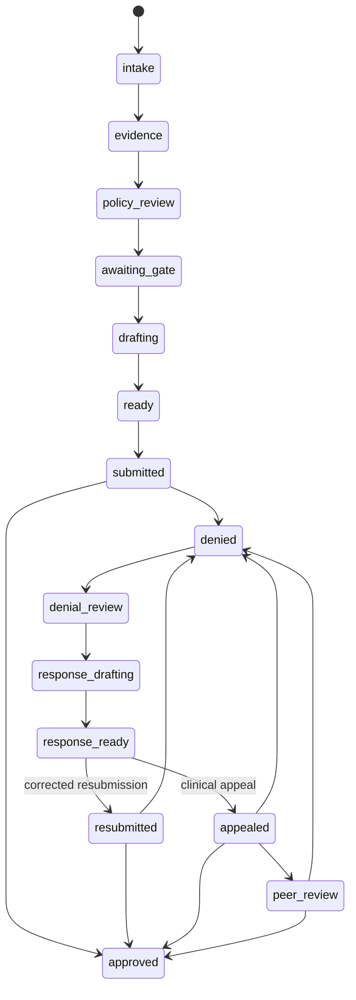

# Web case-to-letter workflow contract

**Status:** Frozen for `runtime-architecture › web-case-to-letter`
**Date:** 2026-09-16
**Acceptance surface:** Browser against the local mounted stack

This document fixes the data, command, authority, publication, invalidation,
error, and fixture contracts for the web workflow. Later changes may add detail
without weakening these rules. A change to a frozen row requires a recorded
architecture decision and an updated dependent-change analysis before code is
changed.

The workflow begins with an authenticated user creating a case and ends with
signed, cited letters for an initial request and both denial-response paths.
Tauri runtime behavior, native SQLite, Flutter, mobile, payer transmission, and
production deployment are outside this acceptance surface. Plan revision 10
records the operator's browser-first course correction: this child reserves the
typed Tauri wrapper names beside each HTTP operation, while RA19 and RA21
implement and verify those wrappers only after web-17 certifies the browser
workflow. No native runtime result can satisfy browser acceptance.

## Normative invariants

1. `criteria` is the canonical criterion relation. `policy_criteria` becomes a
   read-only compatibility surface after a checked migration.
2. `met`, `gap`, and `void` remain distinct. A gap has contradictory or
   insufficient chart evidence and requires a surgeon argument. A void is chart
   silence and requires the coordinator to obtain evidence.
3. Every assertion included in an external letter has a backing document,
   page, and applicable source date: policy facts use `effective_date`, care
   records use `service_date`, `authored_date`, or `effective_date`, and payer
   decisions use `determination_date`. Annotation, policy criterion, payer
   statement, or derived knowledge may add attribution only when the assertion
   also cites that document. Otherwise the assertion is excluded with this
   exact message: `This assertion has no source document. It will not be included.`
4. Generation creates a draft. It cannot affirm a gate, approve a letter,
   sign, acknowledge submission, or confirm a denial class.
5. Gateway policy, shell-neutral `AppServices`, and PostgreSQL independently
   enforce clinical authority. Request bodies contain no actor or practice
   authority.
6. Durable clinical state lives in authoritative Postgres and its authorized
   PEM projection. Scoped Zustand stores hold transient view interaction only.
   No query cache is introduced.
7. A relation is not published until its lane, privacy class, exact columns,
   tenant predicate, revocation behavior, migration, and rollback are approved.
8. Each mutation uses a client-generated UUID command ID. An exact retry returns
   the stored result; the same ID with a changed payload returns
   `command_conflict`; an uncertain response is reconciled through its lookup
   operation before another effect is attempted.
9. Browser certification uses synthetic fixtures and the real local stack. CI,
   component-only fixtures, Tauri, and mobile results are not substitutes.
10. A mandatory `void` blocks gate affirmation, generation, approval, and
    signing until a coordinator obtains and processes source evidence. A
    mandatory `gap` blocks those actions until an authorized surgeon records an
    accepted, source-backed argument or the evidence is replaced. The initial
    evidence revision remains immutable so the work performed is auditable.
11. A signed response does not advance a case. The current signed response and
    its local submission acknowledgement commit atomically; only that
    acknowledgement changes `response_ready` to `resubmitted` or `appealed`.

## Canonical criteria migration matrix

The migration is additive and aborts before changing readers when any row
cannot be mapped exactly. The executable schema delta is
[`schema-web-case-to-letter.sql`](../design/schema/schema-web-case-to-letter.sql);
web-06 must apply that file after the baseline and AI schema files and before
enabling canonical criteria readers or writers. Rollback disables canonical
writers, runs
[`schema-web-case-to-letter-rollback.sql`](../design/schema/schema-web-case-to-letter-rollback.sql),
and reapplies the forward file after correction.

| Legacy source | Canonical `criteria` target | Rule |
|---|---|---|
| `policy_criteria.id` | `criteria.id` | Preserve the UUID. A colliding non-equivalent row aborts the migration. |
| `policies.payer_id` | `criteria.payer_id` | Required and unchanged. |
| none | `criteria.practice_id` | `NULL` for migrated published policy. |
| constant | `criteria.evidence_grade` | `published`. |
| `policy_id` | `policy_id` | Required and unchanged. |
| `section` | `section` | Required and unchanged. |
| `ordinal` | new `criteria.ordinal` | Required positive ordering within a policy section. |
| `label` | `label` | Unchanged. |
| `requirement` | `requirement` | Immutable after migration. |
| UTF-8 requirement bytes | `content_sha256` | Deterministic SHA-256; a supplied different digest aborts. |
| policy effective dates | `validity` | `[effective_from,effective_to)`; open upper bound remains open. |
| `is_mandatory` | `is_mandatory` | Unchanged. |
| `data` plus legacy ordinal | `data` | Preserve existing JSON and record migration provenance without replacing user keys. |
| `created_at` | `created_at` | Preserve the historical creation timestamp exactly. |
| `updated_at` | `updated_at` | Preserve the nullable historical update timestamp exactly. Migration execution time is recorded separately in the migration ledger. |
| `COALESCE(policy_criteria.updated_at, policy_criteria.created_at)` | `last_confirmed_at` | Preserve the deterministic most recent legacy confirmation timestamp. Never substitute migration execution time. |
| no legacy value | `document_id`, new `source_page_number` | Remain null until the exact policy document and page are attached. Such criteria may migrate but cannot be selected for generation. |

After copy, reconciliation compares every mapped field for every UUID: payer,
practice nullability, grade, policy, section, ordinal, label, requirement,
content digest, validity bounds, mandatory flag, JSON data plus migration
provenance, document/page nullability, both historical timestamps, and the
derived `last_confirmed_at` timestamp. Count or
field inequality aborts before reader cutover. After that reconciliation:

- `case_evidence.policy_criterion_id` becomes `criterion_id` and references
  `criteria(id)` without changing existing UUID values.
- The legacy table is retained as `policy_criteria_legacy`, protected by a
  write-refusal trigger. A read-only `policy_criteria` compatibility view exposes
  the former columns from canonical criteria for existing readers.
- New writes target `criteria`; direct writes through the compatibility view or
  legacy table fail explicitly.
- Published or obtained criteria can control a case only when their exact
  source document, page, content hash, and effective range are present.
- Verbal, derived, and peer-shared criteria remain non-controlling and cannot be
  promoted by editing their grade or attribution.
- Rollback disables new writers first and restores the former reader name only
  after row count, UUID, requirement hash, deterministic `last_confirmed_at`,
  and evidence foreign-key equality are proven. It never deletes canonical
  rows that gained observations.

## Case, letter, submission, and determination lifecycle

`approved` and `withdrawn` are the only terminal case states. `denied` records
an adverse determination and is not terminal because the case may continue.
The migration adds the denial-response states below and updates the existing
`denied` terminal flag.

| Current case state | Allowed next state | Required committed fact |
|---|---|---|
| `intake` | `evidence`, `withdrawn` | Required case identity and procedure inputs are complete. |
| `evidence` | `policy_review`, `intake`, `withdrawn` | At least one ready document; entity resolution may run. |
| `policy_review` | `awaiting_gate`, `evidence`, `withdrawn` | One current controlling criteria snapshot and evidence revision. |
| `awaiting_gate` | `drafting`, `policy_review`, `withdrawn` | Current surgeon affirmations cover policy, section, pathway, and plan. |
| `drafting` | `ready`, `awaiting_gate`, `withdrawn` | Current request draft exists; blocking QA passes before `ready`. |
| `ready` | `submitted`, `drafting`, `withdrawn` | Current request is approved and signed; submission acknowledgement commits atomically with `submitted`. |
| `submitted` | `approved`, `denied`, `peer_review`, `withdrawn` | A determination tied to the acknowledged submission. |
| `peer_review` | `approved`, `denied`, `withdrawn` | Peer-review outcome or payer determination. |
| `denied` | `denial_review`, `withdrawn` | Current adverse determination has a source document. |
| `denial_review` | `response_drafting`, `withdrawn` | Authorized human confirmed `administrative_corrected_resubmission` or `clinical_appeal`. |
| `response_drafting` | `response_ready`, `denial_review`, `withdrawn` | Current response draft exists; blocking QA passes before `response_ready`. |
| `response_ready` | `resubmitted`, `appealed`, `response_drafting`, `withdrawn` | Current response is approved and signed; its local submission acknowledgement and case transition commit atomically. Purpose decides the next state. |
| `resubmitted` | `approved`, `denied`, `withdrawn` | New determination tied to the corrected-resubmission acknowledgement. |
| `appealed` | `approved`, `denied`, `peer_review`, `withdrawn` | New determination tied to the clinical-appeal acknowledgement. |
| `approved` | none | Terminal. |
| `withdrawn` | none | Terminal. |

Letter purpose is a required typed column:

| Purpose | Required links | Extra preconditions |
|---|---|---|
| `prior_authorization_request` | case and current criteria/evidence revisions | Current four-part gate, complete source set, blocking QA pass. |
| `corrected_resubmission` | case, challenged determination, original request letter | Confirmed administrative class; answer the named administrative defect. |
| `clinical_appeal` | case, challenged determination, original request letter | Confirmed clinical class; fresh four-part affirmation; answer the sourced denial rationale. |

Letter transitions are `draft → in_review → approved → signed`.
Generation begins at version 1 within a letter purpose. Regeneration creates
the next immutable version for the same case and purpose and marks the prior
unsigned version `superseded`; approved or signed versions never return to
draft. The durable key is `(case_id, purpose, version)`, so an initial request
and its response may each be version 1 without colliding.

A local acknowledgement creates one `submissions` row, ordered attachment
manifest, receipt/custody evidence, and case transition in one transaction. It
records a synthetic or manual channel and never claims actual payer transport.
A submission attempt is numbered within its letter, using
`(letter_id, attempt)`; the submission, letter, and any resulting determination
must share the same case. An initial request and its response may therefore
each have attempt 1 without colliding.
A focused executable proof is
[`schema-web-letter-flow-checks.sql`](../design/schema/schema-web-letter-flow-checks.sql).
A determination is eligible only when it links to an acknowledged submission.
Corrections append reviewer decisions without rewriting the uploaded source.
This rule applies independently to the initial request and every denial
response. Signing alone leaves the case in `ready` or `response_ready`.

## Assertion and citation matrix

| Candidate material | May guide composition | May be an included assertion | Required handling |
|---|---:|---:|---|
| Chart document fact with valid page and date | yes | yes | Store document ID, page, quote, effective date, and content hash. |
| `met` evidence | yes | yes | Must resolve through an evidence citation to the same case/patient document. |
| `gap` evidence | yes | yes | Cite the contradictory/insufficient document; state the shortfall accurately. |
| `void` evidence | yes | no factual assertion | State that the chart is silent; never fabricate a citation. |
| Surgeon annotation with a backing document | yes | yes | Document remains the source; annotation supplies surgeon attribution. |
| Surgeon annotation without a backing document | yes | no | Exclude with the exact unsupported-assertion message. |
| Published/obtained criterion with source document and page | yes | yes | Document is the source; criterion supplies policy attribution and effective range. |
| Criterion without source document/page | yes | no | Block controlling selection or exclude it from prose; never cite a URL alone. |
| Payer verbal, derived, or peer-shared criterion | yes | no | Show provenance in the workspace; never represent it as payer policy. |
| Determination rationale with source document/page/date | yes | yes, in response letter | Link the challenged determination and source document. |
| Parsed or inferred rationale without source location | yes | no | Keep field unknown and require human/source correction. |

`letter_claims.document_id`, `document_version`, `page_number`, `source_quote`,
`source_span_start`, `source_span_end`, `source_date`, and `source_date_kind`
are mandatory for every included claim. The half-open byte span must select the
exact UTF-8 source quote from the immutable page version. `annotation_id` and
`criterion_id` are optional attribution links, not alternative sources. The
referenced document supplies the immutable content hash. A human QA decision
records `support_reviewed_by`, `support_reviewed_at`, the claim revision, and
`supported` or `unsupported`; approval requires `supported` for every included
claim and revalidates page bounds, case/patient scope, version, span, hash, and
date. A pointer to an unrelated page therefore fails even when the document,
page, and date exist. A correction requires a new document or letter revision
and a new support decision.

`source_date_kind` has one vocabulary and one applicability rule across schema,
fixtures, services, and UI: policy assertions use `effective_date`; clinical
records use `service_date`, `authored_date`, or `effective_date` according to
the source; determination assertions use `determination_date`. A date value
that exists but uses the wrong kind is not valid provenance.

## Capability, principal, and enforcement matrix

Every row also requires current membership, selected practice, resource scope,
and the named capability. `User` means a verified human principal.
PostgreSQL reads `aso.practice_id` from the checked-out transaction,
verifies that it belongs to the current Kratos identity, and exposes exactly
that one practice through tenant RLS. Membership in additional practices does
not broaden the active transaction. Clinical triggers also require the target
case practice to equal this verified selection and the recorded actor to equal
the current verified user.

| Action | Capability | Allowed principal | Independent enforcement |
|---|---|---|---|
| Read authorized case workflow | `case:read` | coordinator or surgeon user; administrator only for configuration views | Gate, AppServices, tenant RLS |
| Create/edit case and advance nonclinical intake states | `case_write` | coordinator or surgeon user | Gate, AppServices, tenant RLS/command function |
| Upload a case or determination document | `document_upload` | coordinator or surgeon user | Gate, AppServices, tenant RLS/command function |
| Process a committed document job | `document_process` | narrow internal processor for an authorized queued job | AppServices job grant, tenant SQL function, document/job foreign keys |
| Resolve administering entity | `resolve_administering_entity` | coordinator or surgeon user | Gate, AppServices, tenant RLS/command function |
| Import published catalog configuration | existing `configure` | administrator user | Gate, AppServices, catalog SQL function |
| Attach obtained criteria and select controlling snapshot | `criteria_select` | coordinator or surgeon user | Gate, AppServices, tenant RLS/command function |
| Assemble an evidence revision | `evidence_assemble` | coordinator or surgeon user, or narrow internal processor for its authorized job | Gate for human command, AppServices job/actor grant, tenant SQL function |
| Reassess evidence or accept a gap argument | existing `annotate` | surgeon user | Gate, AppServices, PostgreSQL clinical-authority function |
| Request or complete void evidence work | `evidence_obtain` | coordinator user | Gate, AppServices, tenant SQL function |
| Affirm/remove the four-part clinical gate | existing `affirm_gate` | surgeon user | Gate, AppServices, PostgreSQL clinical-authority function |
| Generate/regenerate a draft | `letter_generate` | coordinator or surgeon user | Gate, AppServices, tenant SQL function and current-token checks |
| Review claims and commit QA support decisions | `letter_review` | coordinator or surgeon user | Gate, AppServices, tenant SQL function and claim-revision checks |
| Approve a letter | `letter_approve` | surgeon user | Gate, AppServices, PostgreSQL clinical-authority function |
| Sign a letter | existing `sign_letter` | surgeon user | Gate, AppServices, PostgreSQL clinical-authority function |
| Record local submission acknowledgement | existing `submit` | coordinator or surgeon user | Gate, AppServices, tenant SQL function and signed-current-letter check |
| Ingest a determination | `determination_record` | coordinator or surgeon user | Gate, AppServices, tenant SQL function and acknowledged-submission FK |
| Correct parsed determination fields | `determination_correct` | coordinator or surgeon user | Gate, AppServices, tenant SQL function and immutable-source rule |
| Confirm denial-response class | `determination_classify` | coordinator or surgeon user | Gate, AppServices, tenant SQL function and current-revision check |

Background processors run through narrow internal ports after an authorized
human command has committed work. They receive no general clinical capability
and cannot perform any authority-bearing action in the table.

`configure`, `affirm_gate`, `annotate`, `sign_letter`, and `submit` retain the
canonical keys already present in `capabilities`. The owning migration for each
new key in the table registers that key before its Gate policy or AppServices
check is enabled; no alias silently renames an existing capability. New
clinical keys such as `letter_approve` are marked clinical and receive the same
independent Gate/AppServices/PostgreSQL enforcement as the existing clinical
keys. The frozen registry and role grants are executable in
[`schema-web-capabilities.sql`](../design/schema/schema-web-capabilities.sql);
`document_process` remains unassigned to every human role. The migration also
removes the legacy administrator `submit` grant. Administrator configuration
authority cannot acknowledge a case submission.

PostgreSQL resolves the target case practice inside each annotation, gate,
approval, and signing trigger, then requires the actor to be active and to hold
the named capability in that exact practice. Tenant RLS covers gate
affirmations and letters as well as cases, documents, and annotations. A case
practice cannot change after any annotation, gate affirmation, or letter exists.
Direct cross-practice probes for all four clinical acts and case reassignment
are executable in
[`schema-web-authority-checks.sql`](../design/schema/schema-web-authority-checks.sql).

## Command and shell-parity matrix

Paths and command names in this table are reserved contracts for the listed
implementation changes. Mutation bodies include `commandId` and the required
expected revision/token. A lost response is looked up beneath a resource known
before dispatch: root scope for case creation, the parent case for child
creation, or the existing resource for update/regenerate/approve/sign. A
lookup never requires the ID created by the lost response. Read operations are
typed but do not create command receipts.

Case mutations and their command lookups return a minimal receipt containing
only the command ID, action, case ID, and commit time. A caller with
`case_write` does not gain case-record visibility from a mutation response or
lost-response lookup. Returning the case record requires the separate
`case:read` capability and a read operation. This keeps write-only coordination
usable without publishing member, plan, procedure, or other case data.

| Change | AppServices operation | HTTP contract | Reserved typed Tauri wrapper for RA19/RA21 |
|---|---|---|---|
| web-01 | create/list/read/update/transition case | `POST /api/cases`; `GET /api/cases`; `GET/PATCH /api/cases/{caseId}`; `POST /api/cases/{caseId}/status`; create lookup `GET /api/case-commands/{commandId}`; other lookups `GET /api/cases/{caseId}/commands/{commandId}` | `create_case`, `list_cases`, `read_case`, `update_case`, `transition_case`, `lookup_create_case_command`, `lookup_case_command` |
| web-03 | read/resolve administering entity | `GET/POST /api/cases/{caseId}/administering-entity`; command lookup under that resource | `read_administering_entity`, `resolve_administering_entity`, `lookup_administering_entity_command` |
| web-04 | upload/read document metadata | `POST /api/cases/{caseId}/documents`; `GET /api/cases/{caseId}/documents/{documentId}`; upload lookup `GET /api/cases/{caseId}/document-commands/{commandId}` | `upload_case_document`, `read_case_document`, `lookup_document_upload_command` |
| web-05 | process/retry document | `POST /api/cases/{caseId}/documents/{documentId}/process`; lookup `GET /api/cases/{caseId}/documents/{documentId}/commands/{commandId}` | `process_case_document`, `lookup_document_process_command` |
| web-06 | import/read criteria catalog | `POST /api/criteria/catalog`; `GET /api/criteria/catalog`; `GET /api/criteria/{criterionId}`; lookup `GET /api/criteria/catalog/commands/{commandId}` | `import_criteria_catalog`, `list_criteria_catalog`, `read_criterion`, `lookup_criteria_import_command` |
| web-07 | read/select controlling criteria snapshot | `GET/POST /api/cases/{caseId}/criteria-selection`; lookup `GET /api/cases/{caseId}/criteria-selection/commands/{commandId}` | `read_criteria_selection`, `select_case_criteria`, `lookup_criteria_selection_command` |
| web-08 | assemble/read evidence revision; record gap argument; request/complete void work | `POST /api/cases/{caseId}/evidence/assemble`; `GET /api/cases/{caseId}/evidence`; `POST /api/cases/{caseId}/evidence/gap-arguments`; `POST /api/cases/{caseId}/evidence/void-work`; `POST /api/cases/{caseId}/evidence/void-work/{workId}/resolve`; lookups `GET /api/cases/{caseId}/evidence-commands/{commandId}` and `GET /api/cases/{caseId}/evidence-work-commands/{commandId}` | `assemble_case_evidence`, `read_case_evidence`, `record_gap_argument`, `request_void_evidence`, `resolve_void_evidence_work`, `lookup_evidence_assembly_command`, `lookup_evidence_work_command` |
| web-10 | generate/read/regenerate initial request | `POST /api/cases/{caseId}/letters`; `GET /api/letters/{letterId}`; `POST /api/letters/{letterId}/regenerate`; generation lookup `GET /api/cases/{caseId}/letter-commands/{commandId}`; regeneration lookup `GET /api/letters/{letterId}/commands/{commandId}` | `generate_letter`, `read_letter`, `regenerate_letter`, `lookup_letter_generation_command`, `lookup_letter_command` |
| web-11 | record/read QA; approve/sign letter; acknowledge/read initial submission | `POST /api/letters/{letterId}/qa`; `POST /api/letters/{letterId}/approve`; existing `POST /api/letters/{letterId}/sign`; `POST /api/cases/{caseId}/submissions/acknowledge`; `GET /api/cases/{caseId}/submissions/{submissionId}`; lookups `GET /api/letters/{letterId}/commands/{commandId}`, existing `GET /api/letters/{letterId}/sign/commands/{commandId}`, and `GET /api/cases/{caseId}/submission-commands/{commandId}` | `record_letter_qa`, `approve_letter`, existing `sign_letter`, `acknowledge_submission`, `read_submission`, `lookup_letter_command`, `lookup_sign_letter_command`, `lookup_submission_command` |
| web-12 | record/read/correct determination | `POST /api/cases/{caseId}/determinations`; `GET/PATCH /api/cases/{caseId}/determinations/{determinationId}`; create lookup `GET /api/cases/{caseId}/determination-commands/{commandId}`; correction lookup `GET /api/cases/{caseId}/determinations/{determinationId}/commands/{commandId}` | `record_determination`, `read_determination`, `correct_determination`, `lookup_determination_command` |
| web-13 | propose/read/confirm response class | `GET/POST /api/cases/{caseId}/determinations/{determinationId}/classification`; lookup `GET /api/cases/{caseId}/determinations/{determinationId}/classification/commands/{commandId}` | `read_denial_classification`, `confirm_denial_classification`, `lookup_denial_classification_command` |
| web-14 | reaffirm response gate; generate/read/regenerate denial response | `POST /api/cases/{caseId}/response-gate/affirmations`; lookup `GET /api/cases/{caseId}/response-gate/commands/{commandId}`; `POST /api/cases/{caseId}/response-letters`; `GET /api/letters/{letterId}`; `POST /api/letters/{letterId}/regenerate`; generation lookup `GET /api/cases/{caseId}/response-letter-commands/{commandId}`; regeneration lookup under known letter | `reaffirm_response_gate`, `lookup_response_gate_command`, `generate_response_letter`, `read_letter`, `regenerate_letter`, `lookup_response_letter_generation_command`, `lookup_letter_command` |
| web-15 | record/read QA; approve/sign response; acknowledge/read response submission | `POST /api/letters/{letterId}/qa`; `POST /api/letters/{letterId}/approve`; existing `POST /api/letters/{letterId}/sign`; `POST /api/cases/{caseId}/submissions/acknowledge`; `GET /api/cases/{caseId}/submissions/{submissionId}`; lookups `GET /api/letters/{letterId}/commands/{commandId}`, existing `GET /api/letters/{letterId}/sign/commands/{commandId}`, and `GET /api/cases/{caseId}/submission-commands/{commandId}` | `record_letter_qa`, `approve_letter`, existing `sign_letter`, `acknowledge_submission`, `read_submission`, `lookup_letter_command`, `lookup_sign_letter_command`, `lookup_submission_command` |
| existing/web-11/web-15 | gate affirm/remove and gate/signing-target reads | Existing `GET /api/cases/{caseId}/gate`, `POST /api/cases/{caseId}/gate/affirm`, `POST /api/cases/{caseId}/gate/remove`, and `GET /api/cases/{caseId}/gate/commands/{commandId}` remain authoritative; new letter reads expose purpose/linkage | Existing `read_gate`, `affirm_gate`, `remove_gate`, `lookup_gate_command`, and signing-target wrappers remain authoritative |

The reserved Tauri wrapper will delegate to the same shell-neutral
`AppServices` operation with the host-owned credential and selected practice.
It will contain no domain logic. Its implementation and verification are
deferred to RA19 and RA21 after web-17, and it is not an acceptance surface in
this child.

### Web-04 document ingestion boundary

The browser may upload only `application/pdf` and UTF-8 `text/plain` documents.
One upload is limited to 16 MiB and 500 pages. The service verifies the exact
caller-provided SHA-256 digest before durable staging. It rejects a declared PDF
without a PDF signature, an unparseable or encrypted PDF, text with a PDF
signature, invalid UTF-8, NUL bytes, empty text, and any document over either
limit. Page count is inspected to enforce the upload bound; Web-05 owns the
canonical page map and commits `page_count` when processing succeeds.

The repository reserves a tenant-scoped command and server-derived storage key,
writes bytes through `DocumentStore`, and then commits queued metadata and the
command receipt. A local store creates a mode-0600 temporary object, flushes it,
publishes it without overwriting an existing object, flushes the parent
directory, and verifies the final digest. A known database refusal abandons the
staging row and removes only bytes whose digest still matches. An uncertain
commit response is reconciled through the command lookup before cleanup. An
exact retry after process restart returns the committed receipt and verifies or
restores the same content-addressed object; a changed payload under the same
command ID fails with `command_conflict`.

Document bytes, storage keys, temporary filenames, source text, and parser
diagnostics containing source text never enter responses, replica shapes, or
logs. The upload principal requires current verified user context and
`document_upload`; metadata reads separately require `case:read`. PostgreSQL
derives the active practice from the verified session and refuses foreign-case
staging. Human roles receive no direct table-write or processor authority.

The browser sends `POST /api/cases/{case_id}/documents` as multipart form data.
The route accepts exactly one each of `commandId`, `documentId`,
`expectedCaseInputRevision`, `expectedDocumentSetRevision`, `documentTypeKey`,
`name`, `effectiveDate`, `mediaType`, `contentSha256`, and `file`; `data` is the
only optional field. Unknown, duplicate, or missing fields return
`invalid_request`. Each metadata field is limited to 32 KiB. A route-local body
limit permits the 16 MiB file plus 64 KiB of multipart overhead, so Axum's
global default cannot reject a valid upload and excess multipart bodies return
`document_too_large`. The file part content type must equal `mediaType`.
Metadata and uncertain-result reads use
`GET /api/cases/{case_id}/documents/{document_id}` and
`GET /api/cases/{case_id}/document-commands/{command_id}`. All three routes are
mounted in the production Axum API router and return `Cache-Control: no-store`.
Their typed refusal codes preserve the frozen Web-00 mapping: 401
`session_required`; 403 `action_forbidden`; 404 `resource_not_found`; 409
`stale_revision` or `command_conflict`; 413 `document_too_large`; 415
`document_type_unsupported`; 422 `document_integrity_failed`; 400
`invalid_request`; and 503 `service_unavailable`.

### Web-05 document processing and mounted status boundary

The protected browser route `/cases/:caseId/intake` resolves
`intake-checklist-route`, renders `CaseIntake`, and mounts `DocumentIntake`.
Uploads flow through `useDocumentUpload` to the multipart HTTP route. The
browser does not call the processing command: `process_case_document` requires
a current service-principal job grant. A synthetic job runner must call the
mounted processor route, after which Electric carries only the approved
`document_statuses` projection into PGlite and PEM. `useDocumentStatuses`
re-joins ordered identifiers with `DocumentStatus` entities for the responsive
view; it does not create a request cache.

Successful processing commits deterministic page numbers and text hashes,
advances `documentSetRevision`, and moves the published status through
`queued`, `processing`, and `ready`. A bounded failure commits `failed` with a
stable error code. An exact retry returns the one committed result. Source
text, embeddings, storage keys, object paths, and parser diagnostics remain
outside the publication and browser response.

The uncomfortable limit is operational: Web-05 does not claim a continuously
running production scheduler or an actual-browser upload-to-ready result.
Web-16 owns the deterministic local job runner, and Web-17 must prove the full
transition in the unchanged-candidate browser campaign.

### Mounted Web-02 browser boundary

Web-02 mounts the case-management slice through the production browser composition: `main.tsx` creates the verified `SessionProvider`, `app-routes.tsx` places protected routes inside `GraphProvider`, and the lazy root, case-dashboard, and intake routes mount `CaseQueue`, `CaseDetail`, and `CaseIntake`. The queue and detail selectors rejoin ordered `replica:cases` identifiers with normalized `Case` records. Search, status filter, selected case, form draft, and command feedback remain identity/session/practice/authorization/epoch/view-scoped interaction state rather than copied domain rows.

Create, update, read, status transition, and uncertain-result lookup pass through the typed `caseApi` HTTP client to the case router merged by `aso_server_axum::api_router`; React and Zustand do not write PGlite or PEM. A command receipt is an acknowledgement, not rendered success. Create and update retain the pre-dispatch expected revision, status, summary fingerprint, and full intake fingerprint. Confirmation waits for the exact committed summary and an authorized case-detail read that matches protected inputs such as member, facility, procedure, plan, and case data. Status-only transitions wait for the captured committed summary state. A later projection cannot redefine the target of an uncertain command.

The browser replica remains memory-only when the experimental clinical materializer is enabled. Selecting persistent storage with that materializer now fails before PGlite opens; the runtime does not silently fall back. Web-02 completes case publication and management. Web-03 adds server-authoritative administering-entity resolution through the mounted case detail view, including effective member enrollment, versioned source metadata, authoritative-input invalidation, scoped uncertain-command recovery, and explicit downstream blocking for parked states. Document ingestion, criteria selection, evidence assembly, both letter workflows, the assembled fixture, and actual-browser certification remain assigned to Web-04 through Web-17.

`reaffirm_response_gate` accepts one of the four existing gate kinds and the
current resolution, criteria-selection, evidence, determination,
classification, and response-gate revisions. It requires `affirm_gate` at
Gate, `AppServices`, and PostgreSQL. A stale token returns `stale_revision`
without an affirmation or command result; an exact retry returns the prior
result; changed reuse returns `command_conflict`. Approval and signing of a
clinical appeal, including the signing-target read, carry the resulting
`responseGateRevision`.

## Error-to-interface matrix

Server responses expose only the stable code. The browser maps it to the exact
copy below and keeps the current committed projection visible unless the error
requires session fencing.

| HTTP | Stable code | Browser copy/action |
|---:|---|---|
| 401 | `session_required` | `Sign in to continue.` Route to the public login surface. |
| 403 | `action_forbidden` | `You do not have permission to perform this action.` Keep the record read-only. |
| 404 | `resource_not_found` | `This record is unavailable in the selected practice.` Do not reveal whether a foreign record exists. |
| 409 | `command_conflict` | `This request ID was already used for different data. Start the action again.` Clear only the matching transient command owner. |
| 409 | `stale_revision` | `This record changed. Review the current version before trying again.` Wait for/refetch the authorized projection. |
| 409 | `invalid_transition` | `This case cannot move to that stage from its current stage.` Show the current stage. |
| 409 | `resolution_ambiguous` | `More than one organization may administer this request. Confirm the plan details.` Park the case. |
| 422 | `case_inputs_incomplete` | `Complete the member, plan, procedure, and service date before continuing.` Focus the first missing field. |
| 413 | `document_too_large` | `This file exceeds the permitted size.` Keep the file uncommitted. |
| 415 | `document_type_unsupported` | `Upload a supported PDF or text document.` Keep the file uncommitted. |
| 422 | `document_integrity_failed` | `The uploaded file did not pass its integrity check.` Remove failed staging. |
| 422 | `document_processing_failed` | `This document could not be processed. Review the file and try again.` Preserve failure details without source text in logs. |
| 409 | `criteria_unresolved` | `The governing criteria have not been confirmed for this case.` Block selection, evidence assembly, and generation. |
| 409 | `criteria_stale` | `The governing criteria changed. Review and select the current version.` Invalidate downstream evidence and drafts. |
| 422 | `citation_incomplete` | `This assertion has no source document. It will not be included.` Exclude the assertion and identify the affected draft row. |
| 422 | `citation_unsupported` | `This citation does not support the assertion. It will not be included.` Record the unsupported QA decision, exclude the assertion from prose, and block approval. |
| 409 | `evidence_work_incomplete` | `Complete the required evidence work before asking the surgeon to affirm.` Show each surgeon argument and coordinator obtain-evidence item. |
| 409 | `gate_stale` | `The clinical gate no longer matches this case. Ask the surgeon to review it again.` Block generation/signing. |
| 409 | `qa_incomplete` | `Complete the blocking letter checks before approval or signing.` Focus the first failing check. |
| 409 | `submission_ineligible` | `Sign the current letter before recording submission.` Do not create acknowledgement records. |
| 409 | `determination_ineligible` | `Record an acknowledged submission before adding a payer decision.` Do not create a determination. |
| 422 | `classification_needs_review` | `Review the denial reason and choose the response path.` Never auto-confirm. |
| 503 | `service_unavailable` | `This service is temporarily unavailable. Your committed work is unchanged.` Preserve uncertain command ownership for lookup. |

Field validation uses `invalid_request` plus typed field errors; it never echoes
clinical source text. Browser validation may improve focus handling but cannot
replace server validation.

## Publication and privacy matrix

All published relations use the server-authoritative relational lane through
the authorized Electric/FRF facade. `trusted` rows require verified identity,
selected practice, exact grant revision, and bounded revocation. Publication
is atomic by revision; a view never treats a partially hydrated join as void.

| Relation/view | Privacy | Exact projected columns | Tenant predicate | Revocation/invalidation | First owning change |
|---|---|---|---|---|---|
| `case_summaries` | trusted PHI | `id, practice_id, case_number, patient_id, surgeon_id, coordinator_id, payer_id, status, date_of_service, gate_affirmed_at, updated_at, revision` | `practice_id = verified_selected_practice_id` | Authorization revision or practice/session change destroys generation | web-02 |
| `administering_entity_resolutions` | trusted | `case_id, entity_id, criteria_set_key, submission_channel_key, appeal_path_key, source_document_id, valid_from, valid_to, state, revision` | join case practice to verified selected practice | Controlling case input change invalidates token | web-03 |
| `document_statuses` | trusted PHI | `id, case_id, document_type_id, name, effective_date, content_sha256_text, page_count, processing_status, processing_error_code, updated_at, revision` | join case practice to verified selected practice | Document mutation or revocation replaces generation | web-05 |
| `criteria_catalog` | trusted mixed provenance | `id, payer_id, practice_id, evidence_grade, policy_id, section, ordinal, document_id, source_page_number, label, requirement, content_sha256_text, procedure_family, is_mandatory, validity, superseded_by` | public published row or `practice_id = verified_selected_practice_id`; peer/private rows excluded unless explicitly granted | Catalog version or scope change refetches | web-06 |
| `case_criteria_selections` | trusted PHI | `case_id, resolution_revision, criteria_snapshot_id, policy_id, selected_criterion_ids, selected_by, selected_at, state, revision` | join case practice to verified selected practice | Resolution/catalog/case-input token change invalidates | web-07 |
| `case_evidence` | trusted PHI | `id, case_id, criterion_id, state, rationale, assessed_at, revision` | join case practice to verified selected practice | Document/selection change replaces evidence revision | web-09 |
| `evidence_citations` | trusted PHI | `id, case_evidence_id, document_id, page_number, quote, relevance, document_effective_date, content_sha256_text` | evidence case practice equals verified selected practice | Evidence/document revision change replaces join atomically | web-09 |
| `letters` | trusted PHI | `id, case_id, purpose, version, status, body_markdown, content_sha256_text, challenged_determination_id, original_request_letter_id, generated_at, approved_at, signed_at, revision` | join case practice to verified selected practice | Evidence/gate/classification change invalidates unsigned current purpose/version | web-11/web-15 |
| `letter_claims` | trusted PHI | `id, letter_id, case_id, ordinal, claim_text, document_id, document_version, page_number, source_quote, source_span_start, source_span_end, source_date, source_date_kind, annotation_id, criterion_id, source_content_sha256_text, support_status, support_reviewed_by, support_reviewed_at, support_claim_version` | letter case practice equals verified selected practice; composite foreign keys require the cited document and letter to belong to the same case | Letter revision replaced atomically | web-11/web-15 |
| `letter_qa_results` | trusted PHI | `id, letter_id, qa_check_type_id, outcome, detail, evaluated_at, revision` | letter case practice equals verified selected practice | Letter revision replaced atomically | web-11/web-15 |
| `submissions` | trusted PHI | `id, case_id, letter_id, channel_key, attempt, submitted_at, status, manifest_sha256_text, total_pages, revision` | case practice equals verified selected practice | New acknowledgement/determination refreshes | web-11 |
| `determinations` | trusted PHI | `id, case_id, submission_id, outcome, decided_on, reason_code, reason_text, appeal_deadline, document_id, source_page_number, classification_state, confirmed_response_type, revision` | case practice equals verified selected practice | Correction/classification change replaces revision | web-13 |

The following never enter a replica shape: document bytes, full extracted page
text, chunks, embeddings, credentials, command-result ledgers, migration and
checkpoint ledgers, raw provider responses, local draft buffers, caret/IME
state, upload staging, parser diagnostics containing source text, and audit
payloads outside an approved view. These are `local` unless a later reviewed
contract classifies a narrower projection. Unknown is `local` and refused.

Rollback removes the relevant shape from grants and clients before dropping a
projected column. Disposable client generations rebuild; authoritative rows
and audit history are retained.

## Invalidation dependency matrix

Each token is immutable for one committed revision. Downstream commands carry
the tokens they observed and fail `stale_revision` when any differs.

| Token | Changes when | Invalidates |
|---|---|---|
| `caseInputRevision` | member, plan, payer, procedure, service date, or facility changes | administering-entity resolution and everything below it |
| `resolutionRevision` | administering entity, delegation, submission channel, appeal path, validity, or source changes | criteria selection, evidence, gate, letters |
| `documentSetRevision` | ready document added, replaced, removed, reprocessed, or its date/hash/page map changes | evidence, gate, unsigned letters |
| `criteriaCatalogRevision` | controlling criterion/source/version/effective range changes | criteria selection and everything below it |
| `criteriaSelectionRevision` | immutable selected snapshot changes | evidence, gate, letters |
| `evidenceRevision` | evidence state, rationale, citation, or included document revision changes | gate and unsigned letters |
| `gateRevision` | affirmation added/removed or any bound upstream token changes | draft eligibility, approval, signing |
| `responseGateRevision` | a post-classification response affirmation is added/removed or its determination, classification, evidence, criteria, or resolution token changes | clinical-appeal generation, approval, signing |
| `letterRevision` | generation/regeneration, claim set, or QA set changes | approval, signing, submission acknowledgement |
| `qaRevision` | QA findings or the human support decision for any included claim changes | approval and signing |
| `signatureRevision` | the selected signature, credential line, current-version status, or signing target changes | signing |
| `submissionRevision` | acknowledgement, attachment manifest, or custody state changes | determination eligibility |
| `determinationRevision` | source, outcome, reason, deadline, or reviewed correction changes | denial classification and response draft |
| `classificationRevision` | proposed/confirmed response type or confirmation actor changes | response generation, QA, signing |

## Deterministic fixture matrix

Task 1.4 supplies the immutable [fixture input manifest](fixtures/web-case-to-letter/fixture-manifest.json),
[expected-output manifest](fixtures/web-case-to-letter/expected-output-manifest.json),
[hash lock](fixtures/web-case-to-letter/manifest-lock.json), and
[focused verifier](fixtures/web-case-to-letter/verify.py). Their format and
hash rules are documented in the [fixture README](fixtures/web-case-to-letter/README.md).
The fixture families and required outcomes are fixed here.

| Fixture | Purpose | Required evidence outcome | Required letter outcome |
|---|---|---|---|
| `request-case` | Initial prior authorization | Initial revision contains `met`, `gap`, and `void`; a surgeon supplies a source-backed accepted gap argument and a coordinator obtains the missing source so the final revision has no mandatory void | One signed `prior_authorization_request` with exact-span supported claims and one local acknowledgement |
| `corrected-resubmission-case` | Standalone administrative denial flow from empty case | Sourced denial identifies a correctable submission defect; classification confirms `administrative_corrected_resubmission` | Original request and acknowledgement, then one signed corrected response and a distinct response acknowledgement that advances the case |
| `clinical-appeal-case` | Standalone medical-necessity denial flow from empty case | Sourced denial challenges a clinical criterion; classification confirms `clinical_appeal`; fresh gate binds current evidence/criteria | Original request and acknowledgement, then one signed appeal and a distinct response acknowledgement that advances the case |
| `low-confidence-denial` | Negative control | Conflicting or incomplete sourced signals | `classification_needs_review`; no response draft |
| `missing-citation-claim` | Negative control | Candidate assertion lacks document/page/date | Exact unsupported-assertion message; assertion absent from persisted claims and prose |
| `unrelated-page-claim` | Negative control | Candidate has a valid document/page/date pointer whose exact span does not support its text | `citation_unsupported`; human support decision blocks approval and prose inclusion |
| `foreign-practice-case` | Tenant negative control | Valid identifier under another synthetic practice | Hidden/refused at gateway, service, database, replica, and browser route |

Every positive fixture starts from an empty case workflow and lists every
mutation command, its pre-dispatch lookup anchor, and exact expected revision
tokens. Every negative control owns disjoint practice, membership, principal,
case, source, and command state plus deterministic reset semantics. The two
denial fixtures are immutable and separate. Correcting or classifying one
cannot mutate the other or reuse its command result.

## Downstream change inputs and outputs

| Change | Required inputs | Required outputs consumed later |
|---|---|---|
| web-00 | Accepted ADRs, executable schema, reviewed child plan | This frozen contract, later fixture manifests, reconciled ADR/spec language |
| web-01 | Case lifecycle, authority and command matrices | Durable case commands, revisions, reads, mounted HTTP contract, and wrapper names reserved for RA19/RA21 |
| web-02 | Case projection/privacy row and web-01 commands | Mounted queue/create/detail/edit/status UI; case graph selectors and scoped interactions |
| web-03 | Case inputs, resolution states/errors, invalidation matrix | Durable administering-entity resolution and `resolutionRevision` |
| web-04 | Document command/error limits and local-content boundary | Atomic upload metadata/bytes, document command receipts |
| web-05 | Uploaded document and document publication row | Deterministic page map, processing state, `documentSetRevision`, mounted upload/status UI |
| web-06 | Criteria migration and citation matrices; processed policy document | Canonical catalog, read-only compatibility, provenance-complete criteria reads |
| web-07 | Resolution plus catalog revisions | Immutable criteria snapshot, `criteriaSelectionRevision`, mounted policy/pathway UI |
| web-08 | Ready documents plus selected criteria snapshot | Atomic three-state evidence revision and citations |
| web-09 | Evidence publication rows | Consistent queue counts, crosswalk, pathway, timeline, and source preview |
| web-10 | Current resolution/criteria/evidence/gate tokens and citation rules | Revisioned cited initial request draft, claims, QA, generation receipt |
| web-11 | Published draft/claims/QA and existing signing boundary | Mounted review/regeneration/QA/sign flow and acknowledged submission |
| web-12 | Acknowledged submission plus sourced determination document | Durable determination revision and reviewed corrections |
| web-13 | Determination revision and classification/error rules | Audited confirmed response type and `classificationRevision`; mounted denial review |
| web-14 | Confirmed class, current tokens, original request, challenged determination | Distinct cited corrected-resubmission or appeal draft, claims, QA, receipt |
| web-15 | Published response draft/claims/QA and signing boundary | Mounted review/regeneration/QA/sign flow for both response types; durable response acknowledgement, `submissionRevision`, and atomic `resubmitted` or `appealed` transition |
| web-16 | All mounted capabilities plus the fixture matrix | Immutable synthetic data, expected-output manifest, current-source local browser runner |
| web-17 | One unchanged candidate and web-16 runner | Tier 2 local-stack and actual-browser evidence for the complete positive and negative campaign |

No downstream change may claim browser readiness from a schema row, fixture
adapter, component test, build, typed Tauri wrapper, or historical run. The
complete claim belongs only to web-17 after the actual browser campaign passes.
